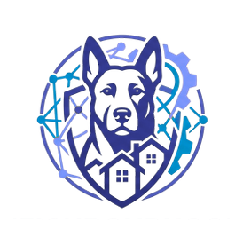
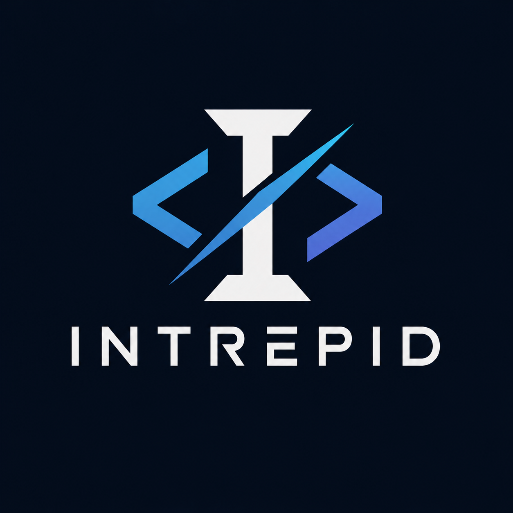
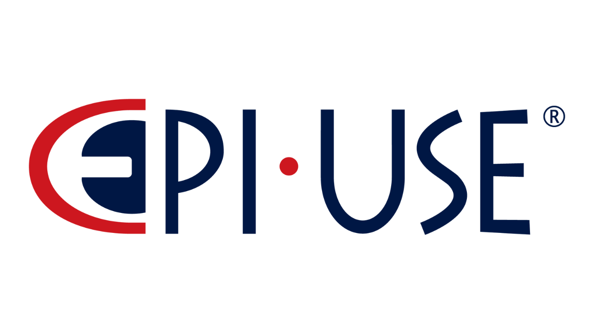
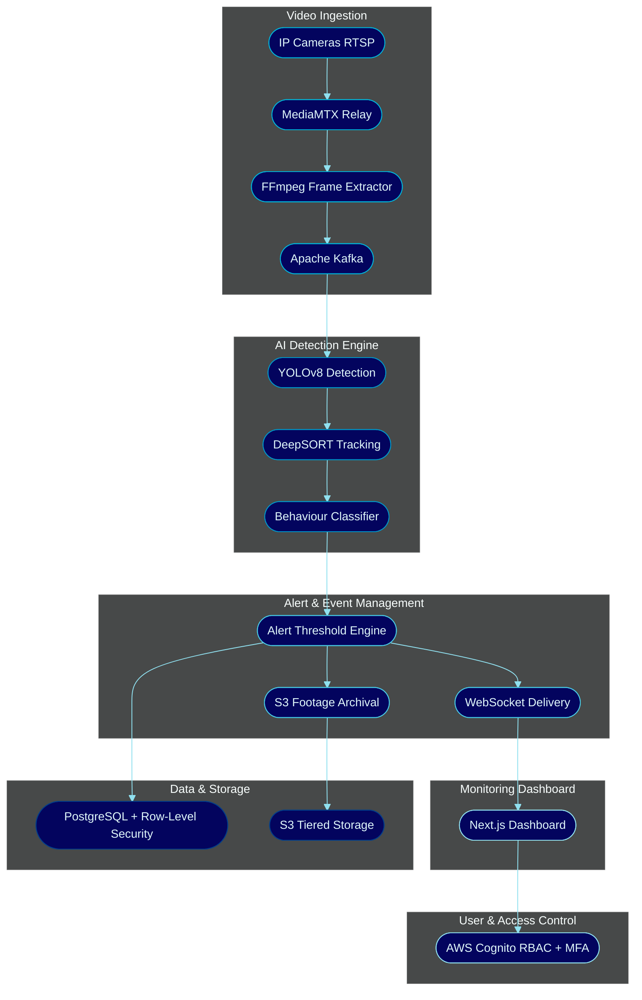
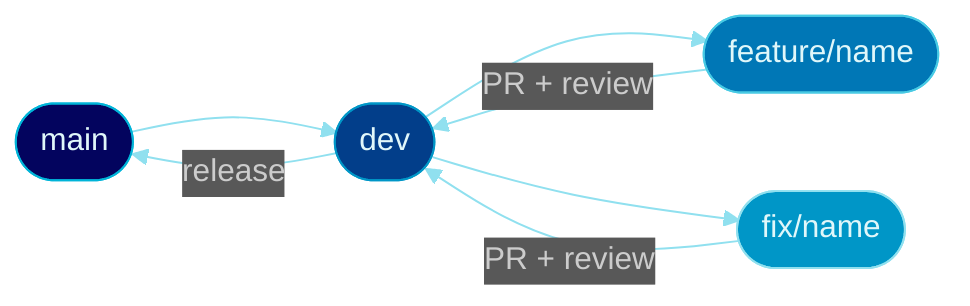

<div align="center">

<br/>

<picture>
  
</picture>

<br/><br/>


<br/><br/>


&nbsp;&nbsp;

&nbsp;&nbsp;


<br/><br/>

[](https://github.com/COS301-SE-2026/Neighbourhood-WatchDog/actions/workflows/ci.yml)
[](https://github.com/COS301-SE-2026/Neighbourhood-WatchDog/actions)
[](https://github.com/COS301-SE-2026/Neighbourhood-WatchDog/commits/Dev)
[](https://github.com/COS301-SE-2026/Neighbourhood-WatchDog/issues)
[](https://github.com/COS301-SE-2026/Neighbourhood-WatchDog/issues?q=is%3Aissue+is%3Aclosed)
[](https://github.com/COS301-SE-2026/Neighbourhood-WatchDog)

</div>

---

## Table of Contents

<details>
  <summary>Click to expand</summary>

- [Project Overview](#project-overview)
- [System Architecture](#system-architecture)
- [Features](#features)
- [Getting Started](#getting-started)
- [Project Structure](#project-structure)
- [Documentation](#documentation)
- [Demo & Presentation](#demo--presentation)
- [Meet Team Intrepid](#meet-team-intrepid)
- [Technologies Used](#technologies-used)
- [Branching Strategy](#branching-strategy)
- [Contact Us](#contact-us)

</details>

---

## Project Overview

**Neighbourhood WatchDog** is a centralised, AI-assisted security platform designed to strengthen community-based safety efforts across South Africa. Built as a **COS 301 Capstone Project** at the **University of Pretoria**, in partnership with **EPI-USE Africa**.

The system integrates community CCTV infrastructure with real-time AI-driven video analysis to detect suspicious activity and surface actionable alerts to security personnel through a unified monitoring dashboard.

Existing CCTV cameras and alarm systems operate in isolation and respond only **after** an incident has occurred. Neighbourhood WatchDog shifts communities from **incident response** toward **incident prevention** — detecting threats before they escalate, tracking individuals across cameras, and generating predictive risk scores for high-risk zones and time windows.

[](https://github.com/orgs/COS301-SE-2026/projects/)

---

## System Architecture

The platform consists of six primary subsystems:



| Subsystem | Description |
|:---|:---|
| **Video Ingestion** | Accepts RTSP streams from IP cameras via MediaMTX relay; extracts frames via FFmpeg and publishes to Kafka |
| **AI Detection Engine** | YOLOv8 + DeepSORT pipeline for human presence detection, behaviour classification, and multi-camera tracking |
| **Alert & Event Management** | Threshold-based alert triggering, real-time WebSocket delivery, footage archival to S3 |
| **User & Access Control** | AWS Cognito RBAC with four roles, MFA for admins, neighbourhood-level data isolation |
| **Monitoring Dashboard** | Next.js real-time dashboard with live alert feed, camera status, stream preview, and incident history |
| **Data & Storage** | Tiered S3 storage (hot/cold), configurable retention policies, PostgreSQL row-level security |

---

## Features

<div align="center">

<table width="100%">
  <tr>
    <td width="33%" valign="top">
      <h3 align="center">Core Features</h3>
      <ul>
        <li>Live RTSP camera stream ingestion via MediaMTX</li>
        <li>Real-time human presence detection (YOLOv8)</li>
        <li>Threshold-based alert generation with WebSocket delivery</li>
        <li>Monitoring dashboard with live alert feed</li>
        <li>Role-based access control (4 roles)</li>
        <li>Incident history with S3 clip retrieval</li>
        <li>MFA enforcement for admins via AWS Cognito</li>
        <li>Neighbourhood-level data isolation</li>
      </ul>
    </td>
    <td width="33%" valign="top">
      <h3 align="center">Advanced Features</h3>
      <ul>
        <li>Loitering and perimeter scanning classification</li>
        <li>Multi-camera individual tracking via DeepSORT</li>
        <li>After-hours intrusion detection</li>
        <li>External notifications: Email, WhatsApp, Discord</li>
      </ul>
    </td>
    <td width="33%" valign="top">
      <h3 align="center">Wow Factors</h3>
      <ul>
        <li>Predictive neighbourhood risk scoring engine</li>
        <li>Alert frequency and incident trend analytics</li>
        <li>Autonomous patrol assistance with movement path summaries</li>
      </ul>
    </td>
  </tr>
</table>

</div>

---

## Getting Started

### Prerequisites

<div align="center">

[](https://www.docker.com/)
[](https://nodejs.org/)
[](https://www.python.org/)
[](https://aws.amazon.com/cli/)
[](https://git-scm.com/)

</div>

### Installation

<details open>
<summary><strong>1. Clone the repository</strong></summary>
<br>

```bash
git clone https://github.com/COS301-SE-2026/Neighbourhood-WatchDog.git
cd Neighbourhood-WatchDog
```

</details>

<details>
<summary><strong>2. Configure environment variables</strong></summary>
<br>

```bash
cp .env.example .env
# Fill in your AWS, Cognito, and database credentials in .env
```

</details>

<details>
<summary><strong>3. Start all services with Docker Compose</strong></summary>
<br>

```bash
docker compose up --build
```

</details>

### Access

| Service | URL |
|:---|:---|
| Dashboard | `http://localhost:3000` |
| API | `http://localhost:8000` |
| API Docs (Swagger) | `http://localhost:8000/docs` |

---

## Project Structure

```
Neighbourhood-WatchDog/
│
├── frontend/          # Next.js dashboard (React, TailwindCSS, HLS.js)
├── backend/           # FastAPI backend (REST API, WebSocket, Celery)
├── ai/                # AI pipeline (YOLOv8, DeepSORT, OpenCV)
├── infra/             # Docker, docker-compose, AWS configuration
├── docs/              # Project documentation
└── assets/            # Logos, images, README assets
```

---

## Documentation

<div align="center">

[](docs/srs.md)


</div>

> Documentation links will be updated after each demo.

---

## Demo & Presentation

<div align="center">

| Demo | Slides | Video |
|:---:|:---:|:---:|
| Demo 1 | [](#) | [](docs/Demo1%20Video.mov) |
| Demo 2 | [](#) | [](#) |
| Demo 3 | [](#) | [](#) |
| Demo 4 | [](#) | [](#) |

</div>

---

## Meet Team Intrepid

<div align="center">


<br/><br/>

<table width="100%">
  <tr>
    <td align="center" width="20%">
      <a href="https://github.com/">
        
      </a>
      <br/><br/>
      <b>Jared Williams</b><br/>
      <sub><code>u24581039</code></sub><br/><br/>
      <br/>
      <br/><br/>
      <sub>Python · FastAPI · React · Next.js · PostgreSQL · Docker</sub><br/><br/>
      <a href="https://github.com/"></a>
      <a href="https://www.linkedin.com/in/jared-williams-5286a6283/"></a>
    </td>
    <td align="center" width="20%">
      <a href="https://github.com/">
        
      </a>
      <br/><br/>
      <b>Ange Yehouessi</b><br/>
      <sub><code>u24614484</code></sub><br/><br/>
      <br/><br/>
      <sub>Python · FastAPI · Node.js · PostgreSQL · REST API</sub><br/><br/>
      <a href="https://github.com/"></a>
      <a href="https://www.linkedin.com/in/ange-yehouessi-624086376/"></a>
    </td>
    <td align="center" width="20%">
      <a href="https://github.com/">
        
      </a>
      <br/><br/>
      <b>Joshua Mahabeer</b><br/>
      <sub><code>u24597092</code></sub><br/><br/>
      <br/><br/>
      <sub>Python · OpenCV · YOLOv8 · React · Docker · C++</sub><br/><br/>
      <a href="https://github.com/"></a>
      <a href="https://www.linkedin.com/in/joshua-mahabeer-286528269/"></a>
    </td>
    <td align="center" width="20%">
      <a href="https://github.com/">
        
      </a>
      <br/><br/>
      <b>Obed Edom Mbaya</b><br/>
      <sub><code>u24595889</code></sub><br/><br/>
      <br/><br/>
      <sub>Python · FastAPI · LangGraph · Next.js · PostgreSQL · Docker</sub><br/><br/>
      <a href="https://github.com/"></a>
      <a href="https://www.linkedin.com/in/obed-edom-mbaya-01197423b/"></a>
    </td>
    <td align="center" width="20%">
      <a href="https://github.com/">
        
      </a>
      <br/><br/>
      <b>Zaman Bassa</b><br/>
      <sub><code>u24744931</code></sub><br/><br/>
      <br/><br/>
      <sub>TypeScript · Python · Docker · PostgreSQL · GitHub Actions</sub><br/><br/>
      <a href="https://github.com/"></a>
      <a href="https://www.linkedin.com/in/zaman-bassa-033673360/"></a>
    </td>
  </tr>
</table>

</div>

---

## Technologies Used

<div align="center">


</div>

<br/>

<details>
<summary><strong>Frontend</strong></summary>
<br/>

| Technology | Purpose |
|:---|:---|
|  | React-based dashboard framework with SSR |
|  | Component-based UI library |
|  | Static typing across the frontend |
|  | Utility-first styling framework |
| HLS.js | Live stream playback in browser |

</details>

<details>
<summary><strong>Backend</strong></summary>
<br/>

| Technology | Purpose |
|:---|:---|
|  | REST API and WebSocket server |
|  | Primary backend language |
|  | Distributed task queue |
|  | Frame event streaming pipeline |
| WebSocket | Real-time alert push delivery |

</details>

<details>
<summary><strong>AI / ML Pipeline</strong></summary>
<br/>

| Technology | Purpose |
|:---|:---|
|  | Real-time human detection |
|  | Frame preprocessing and video I/O |
|  | Model inference backend |
| DeepSORT | Multi-camera individual tracking |

</details>

<details>
<summary><strong>Video Ingestion</strong></summary>
<br/>

| Technology | Purpose |
|:---|:---|
|  | Frame extraction from RTSP streams |
| MediaMTX | RTSP relay and stream management |

</details>

<details>
<summary><strong>Database & Storage</strong></summary>
<br/>

| Technology | Purpose |
|:---|:---|
|  | Primary relational database with row-level security |
|  | Managed PostgreSQL hosting |
|  | Tiered video clip archival |

</details>

<details>
<summary><strong>DevOps & Cloud</strong></summary>
<br/>

| Technology | Purpose |
|:---|:---|
|  | Cloud infrastructure provider |
|  | Compute instances |
|  | Auth, RBAC, and MFA |
|  | Service containerisation |
|  | CI/CD pipelines |
|  | Observability and logging |

</details>

---

## Branching Strategy

This project follows a **Git Flow** branching strategy:



| Branch | Purpose |
|:---|:---|
| `main` | Production-ready releases only |
| `dev` | Integration branch — all features merge here first |
| `feature/<name>` | Individual feature branches, branched from `dev` |
| `fix/<name>` | Bug fix branches, branched from `dev` |

All pull requests require at least **one peer review** before merging into `dev`. Direct commits to `main` are not permitted.

---

## Contact Us

<div align="center">

Have questions, ideas, or want to get in touch?

[](mailto:intrepid.capstone@gmail.com)

<br/><br/>


<sub><i>COS 301 Capstone Project 2026 · University of Pretoria · EPI-USE Africa · Team Intrepid</i></sub>

</div>
