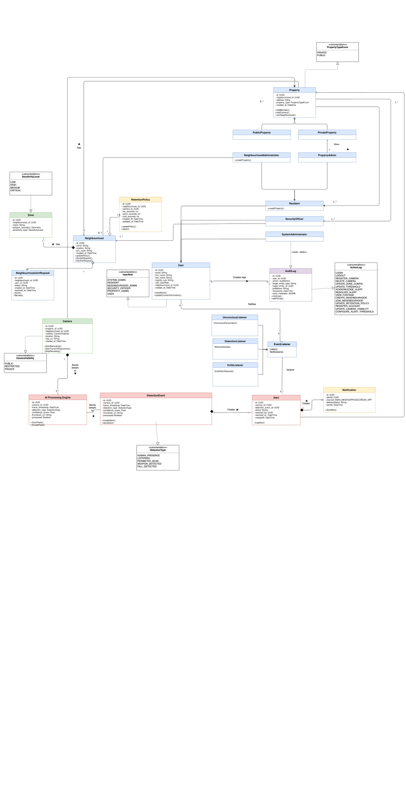

# System Requirements Specification - Neighbourhood WatchDog

version 3.1 Updated 3 September 2026 

## Introduction

### 1.1 Purpose
Neighbourhood WatchDog is an AI-assisted neighbourhood-security platform. It allows authorised residents, property administrators and security personnel to register cameras, connect a paired local WatchDog Agent, relay camera video securely, detect people in configured zones, and surface alerts to an operational dashboard.

### 1.2 Business need and scope
Neighbourhood CCTV is often fragmented: a camera may be visible only on a local network, with no common access model, automated detection, or coordinated alert workflow. WatchDog provides a control plane for registered cameras and paired site agents, a relay path for authorised playback, and a dashboard for detection and alert response.

The system concentrates on the integrated development from camera registration and Agent pairing through enabled-camera reconciliation, secure streaming, person detection, protected-zone configuration, and alert presentation. Advanced behaviour classification and risk prediction remain active requirements.

## User Stories

### E1: Identity & Access Management

- **US-01**: As a new resident, I want to create an account using my email so that I can join my neighbourhood and start using the platform.
- **US-02**: As a registered user, I want to log in with my password so that my account stays secure.
- **US-03**: As a logged-in user, I want to sign out of the platform so that my account is not accessible to anyone else using my device.
- **US-04**: As a system admin, I want to view a complete, read-only audit log of all user activity so that I can investigate any suspicious behaviour or access disputes.

### E2: Neighbourhood & Property Management

- **US-05**: As a resident, I want to create a new neighbourhood so that I can group my neighbours together and manage shared camera coverage.
- **US-06**: As a resident, I want to join an existing neighbourhood using a join code so that I can access its alerts.
- **US-07**: As a neighbourhood admin, I want to approve or deny requests from people wanting to join my neighbourhood so that only verified residents gain access.
- **US-08**: As a resident, I want to create a property and link it to my neighbourhood so that I can associate my home's cameras with the right community.
- **US-09**: As a neighbourhood admin, I want to assign and change roles for neighbourhood members so that each person only has access to what they need.

### E3: Camera Registration & Management

- **US-10**: As a resident, I want to register my home camera on the platform so that its footage can be monitored and analysed for security incidents.
- **US-11**: As a resident, I want to edit my camera's details or temporarily disable it so that I can keep the system up to date without fully removing the camera.
- **US-12**: As a resident, I want to permanently remove a camera I no longer own so that it stops appearing on the platform entirely.
- **US-13**: As a resident, I want to draw detection zones on a camera view and set a confidence threshold so that I only get alerted about activity in areas that actually matter.

### E4: Video Ingestion & Live Streaming

- **US-14**: As a resident, I want to see live video feeds from all my properties' cameras on my dashboard so that I can monitor multiple areas at once without switching between screens.
- **US-15**: As a security officer, I want to click on a camera feed and view it full screen so that I can inspect footage more closely when something looks suspicious.
- **US-16**: As a resident, I want to view live feeds from my own cameras on my dashboard so that I can keep an eye on my property from anywhere.

### E5: AI Detection & Behaviour Classification

- **US-17**: As a resident, I want the system to automatically detect when a person appears in a restricted zone on my camera so that I am alerted without having to watch the feed myself.
- **US-18** As a resident and security officer, I want to receive alerts from the system when a possible weapon is detected to respond to potential threats as quickly as possible.
- **US-19**: As a security officer, I want the system to classify what a detected person is doing so that I can understand the severity of a situation at a glance without reviewing the footage first.
- **US-20**: As a security officer, I want the system to keep track of the same person across multiple frames using a consistent ID so that I can follow their movement without piecing together separate alerts manually.

### E6: Alert Management

- **US-21**: As a security officer, I want to see new alerts appear on my dashboard instantly so that I can respond to incidents as they happen.
- **US-22**: As a security officer, I want to acknowledge an alert so that my team can see that someone is already handling it and avoid duplicated responses.
- **US-23**: As a security officer, I want to watch the video clip that triggered an alert so that I can judge whether the situation requires a physical response.
- **US-24**: As a security officer, I want to browse and filter past alerts so that I can review incidents that happened while I was off duty.
- **US-25**: As a resident, I want to receive a WhatsApp message and email when a high-severity alert is triggered on my camera so that I am notified even when I am not watching the dashboard.
- **US-26**: As a neighbourhood admin, I want to broadcast a critical alert to all neighbourhood members so that everyone can take precautions during a serious security incident.

### E7: Analytics & Risk Intelligence

- **US-27**: As a neighbourhood admin, I want to see charts showing how frequently alerts are occurring across the neighbourhood so that I can identify problem areas and times.
- **US-28**: As a neighbourhood admin, I want to see an overall risk score for my neighbourhood so that I can understand at a glance whether security has been getting better or worse over time.
- **US-29**: As a neighbourhood admin, I want to see how quickly alerts are being acknowledged so that I can identify response time problems and address them.
- **US-30**: As a neighbourhood admin, I want to see incident trends over time so that I can spot recurring patterns and take preventative action before problems escalate.

### E8: Agent Workflow

- **US-31**: As a resident or property owner, I want my enabled camera automatically connected to the paired WatchDog Agent for streaming and detection so that monitoring does not require manual runtime configuration.
- **US-32:** As a resident or a property owner, I want to manually disable the agent to temporarily stop monitoring my property when it is not needed.
- **US-33:** As an authorised user, I want playback to connect only when I select a camera so that video connections and resources are used deliberately.
- **US-34:** As a security officer, I want a fault or shutdown in one camera runtime not to interrupt other enabled cameras so that a local failure does not blind the property.

### E9: Predictive Risk Scoring

- **US-35**: As a neighbourhood admin, I want to see predictions of which time windows and camera zones are at highest risk so that I can schedule patrols proactively rather than just reacting to incidents.
- **US-36**: As a security officer, I want to be notified when a zone's predicted risk level rises significantly so that I can increase my attention to that area before an incident actually occurs.

### E10: Smart Alert Navigation & Neighbourhood Risk Intelligence

- **US-37**: As a security officer, I want to view critical alerts from my neighbourhood on a live map so I can quickly understand where incidents are and what type of incident has been reported.
- **US-38**: As a security officer, I want to view the relevant resident and property information for a so that I can understand the context of the incident.
- **US-39**: As a security officer, I want to see my distance, route, and ETA to an alert so that I can determine how quick I can reach the incident and navigate to it.
- **US-40**: As a security officer, I want to view a heat map showing where confirmed/resolved incidents are concentrated across my neighbourhood so that I can view which areas have higher levels of reported crime.
- **US-41**: As a security officer, I want to filter the incident heat map by a selected date range and adjust its sensitivity so that I can analyse changes in incident concentration over different periods.
- **US-42**: As a security officer, I want to view danger zones based on incident density and camera coverage so that I can identify areas where security risks may be higher due to both frequent incidents and limited surveillance coverage.

### E11: Intelligent Security Officer Dispatch & Availability

- **US-43**: As a security officer, I want to manage my availability status so that the system knows whether I am available to respond to incidents.
- **US-44**: As a security officer, I want to share my location so that my position can be used to determine my proximity to security incidents.
- **US-45**: As a security officer, I want the system to automatically identify and dispatch a critical alert to the nearest eligible security officer in the relevant neighbourhood so that incidents can be attended to promptly.
- **US-46**: As a security officer, I want to receive dispatch requests and have the option to accept or decline them so that I can confirm whether I am able to respond to an incident or not.
- **US-47**: As a neighbourhood administrator, I want unaccepted requests to be automatically reassigned to other eligible security officers and escalated when no one accepts them so that critical incidents do not remain unattended.

### E12: Autonomous Patrol Assistance

- **US-48**: As a security officer, I want the system to identify when a person detected in a critical alert is likely the same individual detected at another property in my neighbourhood so that I can connect related incidents without manually reviewing footage.
- **US-49**: As a security officer, I want related alerts involving the same individual to share a consistent identity so that I can recognise and investigate connected incidents across properties.
- **US-50**: As a security officer, I want to view a chronological summary of alerts associated with a tracked individual so that I can understand where and when the individual was detected across the neighbourhood.
- **US-51**: As a security officer, I want to receive a plain-English situational brief for a matched individual so that I can quickly understand the relevant detections, locations, times, and confidence of the match.
- **US-52**: As a security officer, I want to be notified when a new cross-property match is detected so that I can respond to potentially related incidents without continuously monitoring the dashboard.

---

## Functional Requirements

#### R1: Video Ingestion
    R1.1: Stream Acceptance
        R1.1.1: The system shall accept live video streams from IP cameras.
        R1.1.2: The system shall accept simulated video feeds (such as pre-recorded video files). 
        R1.1.3: The system shall support multiple simultaneous incoming streams.
        R1.1.4: The Agent shall retrieve its assigned enabled-camera configuration and reconcile local runtime state with camera enablement.
    R1.2: Stream Relay
        R1.2.1: The system shall relay incoming camera streams, decoupling the cameras from downstream services.
        R1.2.2: The system shall allow multiple services to consume the same camera stream simultaneously without connecting directly to the camera.
        R1.2.3: The system shall output each relayed stream in an HTTP Live Streaming (HLS) format for a browser-based preview.
        R1.2.4: The system shall provide on-demand WebRTC/WHEP playback only after a user explicitly selects a camera.
    R1.3: Frame Extraction       
        R1.3.1: The system shall extract frames from incoming video streams.
        R1.3.2: Extracted frames shall be pushed to a queue for distribution to AI processing workers.
    R1.4: Format Conversion
        R1.4.1: The system shall support format conversion and re-encoding across different camera types and input sources.

#### R2: AI Detection Processing
    R2.1: Human Presence Detection
        R2.1.1: The system shall detect the presence of humans within defined camera zones. 
        R2.1.2: Video frames shall be preprocessed before analysis to improve detection accuracy.
        R2.1.3: A detection event shall be generated for each confirmed human presence, containing a confidence score, timestamp, and camera identifier. 
        R2.1.4: Detection frames shall be processed asynchronously to ensure continuous camera monitoring without interruption.
        R2.1.5:	The Agent shall submit events/annotations with a paired internal credential; invalid or revoked credentials shall be rejected.
    R2.2: Scored (Emergency-Rating) Detection Events
        R2.2.1: Severity rating (LOW, MEDIUM, HIGH, or CRITICAL) will be assigned to each detection event based on its confidence score and detected behaviour type.
        R2.2.2: Alert record to be triggered only when a detection event's confidence score exceeds a configurable threshold.
        R2.2.3: All triggered alert records will be displayed on the monitoring dashboard in real time and persisted.
    R2.3: Behaviour Classification
        R2.3.1: Classify detected behaviour into predefined categories: loitering, perimeter scanning, unusual movement patterns, weapon detected, fall detected and unconscious/unresponsive detected.
        R2.3.2: The system shall use an individual's movement patterns across consecutive frames as input for behaviour classification.
        R2.3.3: The system shall support model improvement using provided CCTV datasets to improve accuracy for the target environment. 
    R2.4: Tracking (DeepSort)
        R2.4.1: Assign a persistent tracking ID to each detected individual across multiple video frames.
        R2.4.2: Maintain tracking continuity for individuals moving across multiple cameras.
        R2.4.3: The system shall use tracking data to generate a movement path summary per individual for the autonomous patrol assistance feature.
#### R3: Alert and Event Management
    R3.1: Alert triggering
        R3.1.1: Shall show the user a real-time alert on the dashboard when an event occurs (e.g. weapon detected, loitering, person detected in restricted area, etc.)
        R3.1.2: Shall show the user an alert containing information about the event, such as the time, classification, severity and location of the event, and the confidence score.
    R3.2: Alert logging (record) and history
        R3.2.1: The footage that triggered the alert should be saved and timestamped so that the user can review it later.
        R3.2.2: Shall allow user to view footage of alerts.
        R3.2.3: Access to the recordings will be scoped by the same role-based permissions as the access to the video stream.
    R3.3: Notifications
        R3.3.1: Notify the user via WhatsApp and Email when an alert is triggered providing important information about the event (e.g. time).
        R3.3.2: Other users in the neighbourhood should be alerted when there is a severe alert.
#### R4: User/Access Control
    R4.1: Scoped permissions
        R4.1.1: The system should categorise video feeds by 3 different visibilities: public, restricted and private. Restricted video feeds are those which residents have selected to make viewable by security officers.
        R4.1.2: Security officers and neighbourhood admins may view all public, and restricted video streams
        R4.1.3: Residents may view their own private and restricted video streams of cameras on their own property and all public streams. 
        R4.1.4: System admin may see all public video streams.
        R4.1.5:	Stream-viewing and alert access shall be checked against the same relevant camera-visibility and role policy before playback is offered.
        R4.1.6:	RTSP URLs, Agent credentials, MediaMTX publisher credentials and backend internal tokens shall not be returned to ordinary browser clients.
    R4.2: Select visibility of video feeds
        R4.2.1: Shall allow residents to choose which cameras’ streams will be public, restricted or private.
        R4.2.2: Shall allow neighbourhood admins to add camera streams that will be public
    R4.3: Multi-Factor Authentication
        R4.3.1: Will require all users to log in using Multi-Factor Authentication methods.
    R4.4: Audit Trail
        R4.4.1: Log all user activity for  audit purposes.

#### R5: Dashboard
    R5.1: Live Alert Feed
        R5.1.1: The dashboard shall display incoming alerts in real-time without requiring a page refresh.
        R5.1.2: Each alert displayed shall include the camera name, detection type, severity, confidence score, and timestamp.
        R5.1.3: The dashboard shall allow a user to acknowledge an alert, updating its status accordingly.
        R5.1.4: The dashboard shall visually distinguish between unacknowledged, acknowledged, and resolved alerts.
    R5.2: Camera Status Display
        R5.2.1: The dashboard shall display the online and/or offline status of each registered camera.
        R5.2.2: The dashboard shall update camera status indicators in real-time.
    R5.3: Live Stream Preview
        R5.3.1: The dashboard shall display a live stream preview for each camera.
        R5.3.2: The dashboard shall allow a user to select and enlarge a specific camera feed for closer inspection.
        R5.2.3 The dashboard shall display the online or offline status of each paired WatchDog Agent.
    R5.4: Incident History
        R5.4.1: The dashboard shall provide a view of all past alerts, filterable by camera, detection type, date, and status.
        R5.4.2: The dashboard shall allow a user to view the footage clip associated with a historical event.
    R5.5: Administrative Configuration
        R5.5.1: The dashboard shall allow an administrator to register and remove cameras.
        R5.5.2: The dashboard shall allow a user to define and configure restricted zones per camera upon camera registration.
        R5.5.3: The dashboard shall allow a security officer or neighbourhood administrator to set the confidence threshold for alert triggering.
    R5.6: Responsiveness
        R5.6.1: The dashboard shall be accessible and functional on both desktop and mobile browsers.

#### R6 Analytics and Reporting
    R6.1 Risk Scoring
        R6.1.1 The system shall calculate a risk score for each neighbourhood based on historical incident data and alert frequency.
        R6.1.2 The system shall integrate incident severity levels and time into the risk score calculations.
        R6.1.3 Update the risk score of zones and neighbourhoods weekly.
        R6.1.4 The system shall classify risk scores into High, Medium and Low risk
        R6.1.5 The system shall maintain historical risk score records for analysis of trends.
    R6.2 Alert Frequency Dashboard
        R6.2.1 Combine alert data over configurable time intervals
        R6.2.2 The system shall allow a user to group alerts by time period, camera or zone, property and severity
        R6.2.3 Display alert frequency by selected filters using graph visualizations
        R6.2.4 Update dashboard when new alerts are recorded.
    R6.3 Response Time Metrics 
        R6.3.1 Record timestamp when an alert is generated and when the security officer marks the alert as acknowledged indicating that it has been dealt with.
        R6.3.2 Generate metrics on the average response times in a neighbourhood
    R6.4 Incident Trend Analysis
        R6.4.1 Generate and show aggregate incident data over time
        R6.4.2 Group incidents based on time period, location and incident type.
        R6.4.3 Identify increases in incident frequency over time
        R6.4.4 Identify recurring incident patterns
        R6.4.5 Use graphical representation for incident trends
        R6.4.6 Allow user to filter incident trends based on date ranges and incident types

#### R7 User Registration
    R7.1 User Registration
        R7.1.1 Allow new resident to register an account
        R7.1.2 Shall verify the resident’s email address by sending an OTP to the user’s email address.
    R7.2 Neighbourhood Creation
        R7.2.1 Allow a resident to create a new neighbourhood 
        R7.2.2 System create a unique join code for distribution
    R7.3 Neighbourhood Association
        R7.3.1 User can select or provide neighbourhood identifier to register for neighborhood
        R7.3.2 User can enter a code to enter a specific neighbourhood
        R7.3.3 User can request to join a neighbourhood
        R7.3.4 Admin User able to accept or deny requests to join neighbourhoods
    R7.4 Camera Registration
        R7.4.1 Allow user to register a new camera
            R7.4.1.1 User must select a privacy type for the camera
            R7.4.1.2 User may select a name and location for camera
            R7.4.1.3 An authorised user shall assign a camera to the appropriate paired WatchDog Agent/site runtime where applicable.
        R7.4.2 Allow user edit properties of camera
            R7.4.2.1 User able to change name and location
            R7.4.2.2 Disable camera permanently or temporarily
            R7.4.2.3 Allowed to deregister the camera
        R7.4.3 System will associate the camera to a property
    R7.5 User Authentication
        R7.5.1 User signing in with extra verification of OTP activating a new session
        R7.5.2 Allow user to sign out terminating active session
    R7.6 Watchdog Agent Management
        R7.6.1 Allow a resident to pair a WatchDog Agent with their account.
        R7.6.2 Allow a resident to manage the cameras assigned to a paired WatchDog Agent.
        R7.6.3 Allow a resident to enable or disable monitoring performed by a paired WatchDog Agent.
        R7.6.4 Allow a resident to add and remove cameras from the agent.

#### R8 Property Management
    R8.1 Property Creation
        R8.1.1 A resident may create a new property and they will become the property admin for that property.
        R8.1.2 A user can request to add a property to a neighbourhoods.
        R8.1.3 The neighbourhood admin may approve or reject the request to a neighbourhood.
    R8.2 Property Membership Management
        R8.2.1 Property admin may invite residents to a property (people that live there as well). 
        R8.2.2 Property admin may remove residents from a property.
        R8.2.3 Residents can leave property voluntarily.
        R8.2.4 Residents shall receive a notification when invited to a property and be able to accept or decline the invitation.
    R8.3 Property Ownership and Control
        R8.3.1 Property admin may transfer property admin ownership to another user (when moving out).
        R8.3.2 A resident who is part of a property is allowed to request ownership of a property.
    R8.4 Property-Camera Association
        R8.4.1 Associate Cameras with the property
        R8.4.2 Admin can manage cameras within property

#### R9 Security Management
    R9.1 Company Registration
        R9.1.1 Security System allows the company to register an account 
        R9.1.2 Email verification before activating the company account
    R9.2 Security Personnel Management
        R9.2.1 Company is able to register multiple security personnel accounts 
        R9.2.2 Company has overview of security personnel
        R9.2.3 Company can allocate personnel to neighbourhoods they joined.
        R9.2.4 Company able to deallocate personnel from neighbourhoods
        R9.2.5 Company can see all incidents the personnel have responded to.
    R9.3 Neighbourhood association
        R9.3.1 Companies can view all public camera feeds within neighbourhood
        R9.3.2 System allows companies to view all restricted cameras
        R9.3.3 Can view active alerts of neighbourhoods
        R9.3.4 Can view all neighbourhoods they have joined and the personnel allocated to the neighbourhoods
        R9.3.5 View incident history of neighbourhoods 
        R9.3.6 View all invites to neighbourhoods
	    R9.3.6.1 Company can choose to view the neighbourhood and its details
	    R9.3.6.2 Company is able to accept or decline requests to join the neighbourhoods
    R9.4 Security Response Management
        R9.4.1 View all alerts that have been dispatched
        R9.4.2 Change the status of the alerts list the alert status here
        R9.4.3 View respondees of the alert
        R9.4.4 View the timeline of the alert and the state changes
#### R10: Smart Alert Navigation and Neighbourhood Risk Intelligence

R10.1 Critical Alert Map
    R10.1.1: The system shall display critical alerts from the security officer's current neighbourhood on a map.
    R10.1.2: Each mapped critical alert shall display its incident type, severity, status, location, and associated camera/property information.
    R10.1.3: The system shall restrict mapped alerts to the security officer's authorised neighbourhood.
    R10.1.4: The system shall provide a fallback list of critical alerts when an alert does not contain valid map coordinates.
R10.2 Resident and Property Context
    R10.2.1: The system shall allow an authorised security officer to view resident and property information associated with a critical alert.
    R10.2.2: Resident and property information shall only be accessible to authorised users within the relevant neighbourhood.
R10.3 Alert Navigation
    R10.3.1: The system shall calculate the distance between the security officer's latest known location and a critical alert.
    R10.3.2: The system shall provide a route and estimated arrival time from the security officer's location to the alert.
    R10.3.3: The system shall update the estimated arrival time when the security officer's location changes.
    R10.3.4: The system shall allow the security officer to open the route in an external navigation application where supported.
R10.4 Incident Heat Map
    R10.4.1: The system shall aggregate confirmed and resolved incidents spatially across the neighbourhood.
    R10.4.2: The system shall display incident concentration using a heat map.
    R10.4.3: The system shall allow the user to select the date range used to calculate the incident heat map.
    R10.4.4: The system shall allow the user to adjust the sensitivity of the incident heat map.
    R10.4.5: The system shall prevent areas without incidents from being presented as incident hotspots.
R10.5 Danger-Zone Overlay
    R10.5.1: The system shall calculate danger zones using incident density and camera coverage.
    R10.5.2: The system shall display danger zones as an independent map overlay from the incident heat map.
    R10.5.3: The system shall restrict danger-zone information to the relevant neighbourhood.

#### R11: Intelligent Security Officer Dispatch and Availability
R11.1 Officer Availability
    R11.1.1: The system shall allow a security officer to set their availability status to AVAILABLE, BUSY, UNAVAILABLE, or OFFLINE.
    R11.1.2: Only eligible officers with an appropriate availability status shall be considered for immediate alert dispatch.
R11.2 Officer Location Sharing
    R11.2.1: The system shall record the latest known location of a security officer while they are on duty and have location sharing enabled.
    R11.2.2: The system shall record the timestamp associated with each reported officer location.
    R11.2.3: The system shall exclude officers whose location is considered stale from location-based dispatch decisions.
    R11.2.4: Location sharing shall stop when the officer goes off duty, logs out, or revokes location permission.
R11.3 Intelligent Dispatch
    R11.3.1: The system shall identify eligible security officers within the neighbourhood associated with a critical alert.
    R11.3.2: The system shall consider officer availability, location, distance or estimated travel time, workload, alert type, and location freshness when determining dispatch priority.
    R11.3.3: The system shall record which security officer was selected for a dispatch request.
R11.4 Dispatch Acceptance
    R11.4.1: The system shall send dispatch requests to selected security officers.
    R11.4.2: A security officer shall be able to accept or decline a dispatch request.
    R11.4.3: An accepted dispatch shall be associated with the responding security officer.
    R11.4.4: A security officer shall not be able to accept an expired or already-assigned dispatch request.
R11.5 Reassignment and Escalation
    R11.5.1: The system shall attempt to reassign a declined or expired dispatch request to another eligible security officer.
    R11.5.2: The system shall notify an appropriate supervisor or neighbourhood administrator when no eligible officer is available to respond.
    R11.5.3: The system shall maintain the dispatch state when no eligible officer can be assigned.
    R11.5.4: An accepted active alert shall not be automatically reassigned.
    R11.5.5: All dispatch, acceptance, decline, reassignment, and escalation actions shall be recorded in the audit trail.

#### R12: Autonomous Patrol Assistance

R12.1 Single-Camera Tracking Continuity
    R12.1.1: The system shall maintain a consistent tracking ID for a detected individual through brief detection gaps and occlusions where possible.
R12.2 Cross-Property Identity Correlation
    R12.2.1: When a critical alert is generated, the system shall compare the detected individual's appearance embedding against recent embeddings from other properties within the same neighbourhood.
    R12.2.2: The system shall only perform cross-property identity matching using authorised and neighbourhood-scoped data.
    R12.2.3: The system shall treat identity comparisons below the configured confidence threshold as a new identity.
    R12.2.4: A successful identity match shall be recorded against the related alert events.
R12.3 Consistent Cross-Property Identity
    R12.3.1: Alert events identified as belonging to the same individual shall share a persistent identity identifier.
    R12.3.2: Persistent identity information shall be restricted to authorised security officers and neighbourhood administrators.
R12.4 Cross-Property Event Summary
    R12.4.1: The system shall maintain a chronological list of alert events associated with a persistent identity.
    R12.4.2: Each linked event shall include the relevant property, camera, and timestamp.
    R12.4.3: The event history shall be accessible from the relevant alert detail.
R12.5 Situational Brief
    R12.5.1: The system shall generate a plain-English situational brief when a cross-property identity match is confirmed.
    R12.5.2: The situational brief shall include relevant detection types, properties, timestamps, and match confidence.
R12.6 Cross-Property Match Notification
    R12.6.1: The system shall notify authorised security officers when a new cross-property identity match is detected.
    R12.6.2: The notification shall include the persistent identity identifier, relevant properties, and event timestamps.

## API Service Contracts

The OpenAPI standard service contract is hosted at this https://api.neighbourhoodwatchdog.co.za/docs.

---

## Use Cases

R1: Video Ingestion
UC1.1 - Register a Camera Stream (Abstract) 
High-Level:
TUCBW: A Neighbourhood Administrator / Resident can add a new camera to a property..
TUCEW: The Administrator or Resident sees the camera stream registered and appearing on the dashboard with a live preview.
UC1.2 - View Live Camera Feed (Abstract) 
High-Level:
TUCBW: A user selects a camera from the dashboard.
TUCEW: The user sees a live stream preview of the selected camera feed in their browser.

R2: User and Access Control
UC2.1 - Log In with Multi-Factor Authentication (Abstract)
High-Level:
TUCBW: A user enters their credentials on the login screen.
TUCEW: The user has successfully completed MFA verification and sees the dashboard.
UC2.2 - Set Camera Visibility (Abstract)
High-Level:
TUCBW: A Resident navigates to their camera settings and selects a visibility option for one of their cameras.
TUCEW: The Resident sees the camera's visibility updated to public, restricted, or private.
UC2.3 - View Permitted Camera Streams (Abstract)
High-Level:
TUCBW: A Security Officer / Neighbourhood Administrator opens the live streams view on the dashboard.
TUCEW: The Security Officer / Neighbourhood Administrator sees all public and restricted camera streams they are permitted to view, with no access to private streams.

R3: Dashboard
UC3.1 - Monitor Live Alert Feed (Abstract)
High-Level:
TUCBW: A User opens the dashboard.
TUCEW: The Security Officer sees all incoming alerts updating in real time, each showing camera name, detection type, severity, confidence score, and timestamp.
UC3.2 - Filter Incident History (Abstract)
High-Level:
TUCBW: A Security Officer navigates to the incident history view and applies filters.
TUCEW: The Security Officer sees a filtered list of past alerts matching the selected camera, detection type, date range, or status.
UC3.3 - Configure Alert Threshold (Abstract)
High-Level:
TUCBW: A Security Officer or Neighbourhood Administrator navigates to the configuration panel and adjusts the confidence threshold slider for a camera.
TUCEW: The Security Officer or Neighbourhood Administrator sees a confirmation that the new threshold value has been saved and is now active.
UC3.4 - Track an Individual Across Cameras (Abstract)
High-Level:
TUCBW: A Security Officer selects a detected individual from the alert feed to view their movement path. 
TUCEW: The Security Officer sees the individual's tracking ID and full movement path summary across all cameras. 
UC3.5 - Acknowledge an Alert (Abstract)
High-Level:
TUCBW: A Security Officer views an unacknowledged alert on the dashboard.
TUCEW: The Security Officer sees the alert status updated to acknowledged on the dashboard.
UC3.6 - Review Historical Alert Footage (Abstract)
High-Level:
TUCBW: A Security Officer / Resident selects a past alert from the incident history view.
TUCEW: The Security Officer /Resident is able to view the footage clip associated with that alert event.
UC3.7 - Receive Alert Notification (Abstract)
High-Level:
TUCBW: A Security Officer / Resident has registered for notifications and a high-severity alert is triggered. 
TUCEW: The Security Officer / Resident has received a notification via WhatsApp or email containing the event details. 

R4: Analytics and Reporting
UC4.1 - View Neighbourhood Risk Score (Abstract)
High-Level:
TUCBW: A user opens the analytics page.
TUCEW: The user sees the current risk score for their neighbourhood, categorised as LOW, MEDIUM, or HIGH, calculated from historical incident data.
UC4.2 - Analyse Incident Trends (Abstract)
High-Level:
TUCBW: A user applies date range and incident type filters in the trend analysis view.
TUCEW: The user sees graphical representations of incident trends over the selected period, grouped by time, location, and type.

R5: User Registration
UC5.1 - Register a New Account (Abstract)
High-Level:
TUCBW: A new user navigates to the registration page and submits their details.
TUCEW: The user sees a confirmation that their account has been created and can now log in.
UC5.2 - Register as Security Officer(Abstract)
High-Level:
TUCBW: The Security Officer once registered as a user can choose to join the waiting pool until they are assigned to a Neighbourhood.
TUCEW: The Security Officer gets a confirmation stating that they have been added to the waiting pool.

R6: Property Management
UC6.1 - Create a Property (Abstract)
High-Level:
TUCBW: A Resident creates a new property.
TUCEW: The property is created and the Resident is presented with the option to add cameras to the property and to add the property to a neighbourhood.

UC6.2 - Invite Resident to Property (Abstract)
High-Level:
TUCBW: A Property Administrator searches for a user and sends them an invitation to join the property.
TUCEW: The Property Administrator sees a confirmation that the invitation has been sent and the recipient receives a notification inviting them to join the property.
UC6.3 - Respond to Property Invitation
High-Level:
TUCBW: A Resident receives a notification that they have been invited to join a property and either accepts or rejects it.
TUCEW: The Resident sees confirmation that they have accepted or declined the invitation.
UC6.4 - Remove resident from property
High-Level:
TUCBW: A Property Administrator can remove a resident from a property.
TUCEW: The Resident will be notified that they have been removed from a property and the property Administrator receives a notification that the resident has been removed. 

R7 Neighbourhood Management

UC7.1 - Create a Neighbourhood (Abstract)
High-Level:
TUCBW: A Resident with a property creates a new neighbourhood.
TUCEW: The user sees the newly created neighbourhood and receives a unique join code for distribution to residents.
UC7.2 - Remove property from Neighbourhood (Abstract)
High-Level
TUCBW: A Neighbourhood Administrator can remove the property from the neighbourhood.
TUCEW: The Neighbourhood Administrator views a confirmation dialogue to confirm that the property has been removed and the Residents of the property receive notification stating that their property has been removed from the neighbourhood.

UC7.3 - Request to Add Property to Neighbourhood (Abstract)
High-Level
TUCBW: A Property Administrator requests to add a property to a neighbourhood using the neighbourhood’s join code.
TUCEW: The Neighbourhood Administrator receives the request to add the property to the neighbourhood and can accept or reject it.
UC7.4 - Request to Add Property to Neighbourhood Approved (Abstract)
High-Level
TUCBW: A Neighbourhood Administrator approves the request to add a property to the neighbourhood.
TUCEW: The property is added and all its public and restricted cameras are visible to the other Users linked to that neighbourhood as well as the Security Officer.
UC7.5 - Request to Add Property to Neighbourhood Rejected (Abstract)
High-Level
TUCBW: A Neighbourhood Administrator rejects the request to add a property to the neighbourhood.
TUCEW: The Property Administrator is presented with a notification informing them that the request has been rejected and they are unable to submit another request for 24 hours.

UC7.6 - Adding a Security Officer to a Neighbourhood (Abstract)
High-Level:
TUCBW: The Neighbourhood Administrator can select a Security Officer to invite to the neighbourhood from a list of existing officers.
TUCEW: The Security Officer can accept or reject the invitation to join the neighbourhood.

R8 WatchDog Agent and Camera Management

UC8.1 – Install the WatchDog Agent (Abstract)
High-Level:
TUCBW: A Resident or Neighbourhood Administrator downloads the WatchDog Agent installation package and executes the installation script (.bat file).
TUCEW: The WatchDog Agent is successfully installed on the user's computer and is ready to be paired with their Neighbourhood WatchDog account.

UC8.2 Pair a WatchDog Agent with an Account (Abstract)
High-Level:
TUCBW: A Resident or Neighbourhood Administrator opens the WatchDog desktop agent and enters the pairing token generated from their Neighbourhood WatchDog account.
TUCEW: The WatchDog Agent is securely linked to the user’s account and is authorised to retrieve and manage the cameras assigned to that user.

UC8.3 - Automatically Monitor Enabled Camera Streams (Abstract)
High-Level:
TUCBW: A Resident or Neighbourhood Administrator enables one or more registered cameras in the Neighbourhood WatchDog platform.
TUCEW: The paired WatchDog Agent automatically detects the enabled cameras, starts the required video publishing and detection processes, and makes the available camera streams accessible through the platform.

UC8.4 - Stop Monitoring a Disabled Camera (Abstract)
High-Level:
TUCBW: A Resident or Neighbourhood Administrator disables a registered camera through the camera settings page.
TUCEW: The WatchDog Agent automatically stops the video publishing and detection processes for the disabled camera, and the camera is no longer available for live viewing or monitoring.

UC8.5 - Isolate a Camera Runtime Failure (Abstract)
High-Level:
TUCBW: A camera stream, video publisher, or detection process fails while other cameras are being monitored by the WatchDog Agent.
TUCEW: The affected camera is marked as unavailable or offline, while the WatchDog Agent continues monitoring all other operational cameras without interruption.

R9: Secure On-Demand Camera Playback
UC9.1 - Request Secure Live Camera Playback (Abstract)
High-Level:
TUCBW: An authorised user selects an available camera from the dashboard and opens the live camera view.
TUCEW: The user receives an authorised, secure live video stream for the selected camera in their browser.

UC9.2 - Start Playback Only When Requested (Abstract)
High-Level:
TUCBW: An authorised user selects a camera and chooses to view its live stream.
TUCEW: The platform establishes the live video connection only for the selected camera, reducing unnecessary network and processing usage for cameras that are not actively being viewed.

UC9.3 - Prevent Unauthorised Camera Playback (Abstract)
High-Level:
TUCBW: A user attempts to request playback for a camera stream that they are not permitted to view.
TUCEW: The platform denies access to the camera stream and does not establish a live playback connection.

R10: Smart Alert Navigation and Neighbourhood Risk Intelligence
<!-- TODO: Add Use case diagram -->
UC10.1 - View Critical Alerts on Map (Abstract)
High-Level:
TUCBW: A Security Officer opens the alert map for their neighbourhood.
TUCEW: The Security Officer sees the critical alerts for their authorised neighbourhood displayed on the map.

UC10.2 - View Resident and Property Context (Abstract)
High-Level:
TUCBW: A Security Officer selects a critical alert associated with a property.
TUCEW: The Security Officer sees the authorised resident and property information associated with that alert.

UC10.3 - Navigate to Critical Alert (Abstract)
High-Level:
TUCBW: A Security Officer selects a critical alert and requests navigation.
TUCEW: The Security Officer sees their distance, route, and estimated arrival time to the alert.

UC10.4 - Analyse Incident Heat Map (Abstract)
High-Level:
TUCBW: A Security Officer opens the neighbourhood risk map and selects a date range and sensitivity.
TUCEW: The Security Officer sees incident concentrations represented as a heat map for the selected period.

UC10.5 - View Danger Zones (Abstract)
High-Level:
TUCBW: A Security Officer enables the danger-zone overlay.
TUCEW: The Security Officer sees areas identified using incident density and camera coverage.

R11: Intelligent Security Officer Dispatch and Availability
<!-- TODO: Add Use case diagram -->
UC11.1 - Manage Officer Availability (Abstract)
High-Level:
TUCBW: A Security Officer opens their availability settings.
TUCEW: The Security Officer's availability status is updated and used by the dispatch system.

UC11.2 - Share Officer Location (Abstract)
High-Level:
TUCBW: A Security Officer enables location sharing while on duty.
TUCEW: The system records the officer's latest location and timestamp for dispatch decisions.

UC11.3 - Dispatch Critical Alert (Abstract)
High-Level:
TUCBW: A critical alert requires a security response.
TUCEW: The system selects an eligible security officer and sends them a dispatch request.

UC11.4 - Accept or Decline Dispatch (Abstract)
High-Level:
TUCBW: A Security Officer receives a dispatch request.
TUCEW: The Security Officer accepts or declines the request and the alert's dispatch state is updated.

UC11.5 - Reassign or Escalate Dispatch (Abstract)
High-Level:
TUCBW: A dispatch request is declined, expires, or has no eligible responding officer.
TUCEW: The system reassigns the request or escalates it to the appropriate administrator.

R12: Autonomous Patrol Assistance
<!-- TODO: Add Use case diagram -->
UC12.1 - Correlate Individual Across Properties (Abstract)
High-Level:
TUCBW: A critical alert is generated for a detected individual.
TUCEW: The system compares recent identity embeddings and identifies whether the individual is likely associated with another alert in the neighbourhood.

UC12.2 - View Cross-Property Event History (Abstract)
High-Level:
TUCBW: A Security Officer opens the details of an individual associated with multiple alerts.
TUCEW: The Security Officer sees a chronological summary of the linked alert events.

UC12.3 - View Situational Brief (Abstract)
High-Level:
TUCBW: A cross-property identity match is confirmed.
TUCEW: The Security Officer sees a plain-English summary of the matched events.

UC12.4 - Receive Cross-Property Match Notification (Abstract)
High-Level:
TUCBW: The system confirms a cross-property identity match.
TUCEW: The Security Officer receives a notification containing the relevant identity and event information.

---

## Domain Model

## Architectural Requirements
 
### Quality/Non-Functional Requirements
 
The quality requirements are derived directly from the non-functional requirements and drive the architectural decisions made in this system.
 
#### Performance
 
- The system shall ingest and process video streams with a latency of less than 4 ms from capture to dashboard display.
- The system shall support up to 100 concurrent video streams without frame loss.
- AI detection processing shall complete within 1 second per frame.
- Alerts shall appear on the dashboard within 2 seconds of detection.
- Notifications shall be delivered within 5 seconds of alert generation.
- The system shall respond to at least 95% of API requests within 2 seconds under normal operating conditions.
- The system shall support at least 500 concurrent users.
#### Scalability
 
- The system shall scale to support 1000+ cameras per neighbourhood.
- AI workers and streaming services shall support horizontal scaling independently of one another.
- The frame queue shall support a burst load of at least 10,000 frames per minute.
- The system architecture shall support an increase in workload of up to 200% without requiring major architectural changes, while maintaining no more than a 10% decrease in performance.
#### Security

- All video streams, API communication, and inter-service communication shall use TLS 1.3 encryption.
- Multi-Factor Authentication shall be enforced for all users.
- User authentication shall be managed using AWS Cognito with Multi-Factor Authentication (MFA) enabled.
- User data stored in AWS RDS shall be encrypted at rest using AES-256 encryption.
- Role-Based Access Control shall restrict access to video streams and recordings based on user role.
- User sessions shall expire after 15 minutes of inactivity.
- All user actions shall be logged to an append-only audit trail.

#### Accuracy
 
- On the fixed labelled person-detection evaluation harness, human detection precision shall be at least 60% and recall shall be at least 60%
- Behaviour classification shall be at least 80%
#### Reliability
 
- The system shall maintain at least 99.5% uptime.
- Video ingestion failures on one stream shall not affect other active streams.
- The system shall recover from critical failures within 5 minutes.
- The detection pipeline shall guarantee no loss of critical alert events.
#### Usability
 
- Users shall be able to interpret and respond to alerts within 5 seconds of viewing.
- The dashboard shall update in real time without manual refresh.
- The system shall be fully usable on desktop and mobile browsers.
#### Maintainability
 
- The system shall use a modular architecture with clearly separated subsystems.
- AI models shall be updatable without system downtime.
- Code shall maintain greater than 70% test coverage.
- New features and bug fixes shall be deployable within 2 hours.
- Automated test coverage shall be measured and tracked over time.
#### Compatibility
 
- The system shall support IP cameras from different manufacturers with different video formats.
- Video output shall comply with HLS standards for browser playback.
- The dashboard shall support the latest versions of major browsers including Chrome and Firefox.
#### Auditability
 
- All detection events, alerts, and user actions shall be logged.
- Audit logs shall be retained for at least 90 days.
- Audit logs shall support filtering by user, time, and action type.
#### Data Retention and Storage
 
- Alert-triggered video clips shall be stored for up to 90 days.
- Storage systems shall support retrieval of video footage within 3 seconds.
#### Compliance
 
- The system shall comply with the Protection of Personal Information Act (POPIA).
- Personal data shall be collected for specific, lawful purposes and shall not be retained longer than necessary.
- Users shall be informed that video surveillance is in operation.
- The system shall support data subject access requests.
- All personal data shall be stored securely and protected against unauthorised access or breaches.

#### NFR Traceability Matrix

| NFR ID | Quantified requirement | Design tactic / implementation | Verification test / tool | Target | Actual result | Status |
|---|---|---|---|---:|---|---|
| QR-01 | On the fixed labelled person-detection evaluation harness, human detection precision shall be at least 60% and recall shall be at least 60%. | The person detector uses a confidence threshold of `0.25` and NMS IoU threshold of `0.70`, selected through a 49-candidate tuning search. DeepSORT tracking and `TEMPORAL_CONFIRMATION_FRAMES=3` prevent alerts from being raised from a single unconfirmed frame. | `ai/evaluation/run_baseline.py` executed against the fixed 24-item labelled person-detection harness. Temporal confirmation is verified separately by `ai/tests/test_alert_confirmation.py`. | Precision ≥60%; Recall ≥60% | Precision **96.67%**, recall **96.67%**, F1 **96.67%**; **29 TP, 1 FP, 1 FN**. | Met |

### Availability

| ID | Quantified Requirement | Tactic in SAS | Test / tool | Target | Actual |
|---|---|---|---|---|---|
| QR-02 | ECS recovers killed task to health within 360s | ECS circuit breaker + ASG. Health check threshold is set at 5 x 30s to avoid premature failover on transient blips | Manually run `aws ecs stop-task`, time until ALB target group reports healthy again | < health-check grace period (360s once reverted from the temporary 10s) | 337s |
| QR-03 |  mediamtx stream resumes within 60s of a mediamtx restart | Edge agent RTSP reconnect/retry with backoff | Restart mediamtx container, time until WebRTC stream is viewable again | < 60s | 5.5s (T0 20:58:51Z, readyTime 20:58:56.8Z) |

### Security

| ID | Quantified Requirement | Tactic in SAS | Test / tool | Target | Actual |
|---|---|---|---|---|---|
| QR-04 | Zero high/critical dependancy CVEs on `main` | Automated dependancy scanning in CI | `pip audit` + `npm audit` | 0 high or critical | 0 findings |
| QR-05 | Zero medium+ severity findings on staging | Input validation, security headers, limited exposure | OWASP ZAP baseline scan again staging | 0 medium+ | 0 () |
| QR-04 | 0 secrets committed to the repository | Making use of GitHub Actions secrets and Secrets Manager | `gitleaks` | 0 findings | 0 findings |

### Recoverability 

| ID | Quantified Requirement | Tactic in SAS | Test / tool | Target | Actual |
|---|---|---|---|---|---|
| QR-05 | A failed production deployment can be rolled back to the previous health task definition within 5 minutes | ECS task definition rollback and the deployment circuit breaker | Force a bad deploy and run the documented rollback command and test time until health | <= 5 mins | service never left healthy state because the circuit breaker prevented the bad revision from ever reaching majority healthy status. The broken task auto stopped within seconds. 2 out of 3 good tasks kept serving throughout. |
| QR-06 | Edge agent continues operating in last-known camera config for at least indefinitely if the backend is not reachable | Local caching of the last successful request for the list of enabled cameras | Turn the backend off and on and observe whether the stream continues to be pushed on the list of existing cameras | runs indefinitely | runs indefinitely thanks to caching of camera configurations. And when it does send out requests, it sends them out with exponential backoff so it will not further break the backend if there are issues with it. |

### Scalability

| ID | Quantified Requirement | Tactic in SAS | Test / tool | Target | Actual |
|---|---|---|---|---|---|
| QR-07 | ECS launches an additional task within 3 minutes of sustained CPU and/or memory threshold being exceeded under load | ASG and ECS target-tracking auto-scaling policy | Locust load test sustained past the threshold, watch `describe-services` for scale out event | <= 3 minutes | +-38s (alarm transitioned to ALARM at 19:48:44Z UTC and the earliest observable capacity improvement in Locust data was at 19:49:22Z UTC) |
| QR-08 | p95 latency stays under 2500ms at 500 concurrent virtual users at 300 RPS | Connection pooling + indexing + auto-scaling and Redis caching for selected endpoints | Sustained Locust load test, 500 VUs, 12.5min | p95 < 2500ms at 500 Virtual Users | 2400ms at 500 users at 233-280 RPS |
| QR-9 | Error rate at peak load | Connection pool limit | Locust | <1% | 0.24% |

### Maintainability

---
 
### Architectural Patterns

#### Microservices Architecture
 
Neighbourhood WatchDog is structured as a set of independently deployable microservices, each responsible for a single bounded context. The six primary subsystems — Video Ingestion, AI Detection, Alert Management, User and Access Control, the Monitoring Dashboard, and Data Storage — are deployed as separate containerised services. This allows each subsystem to be scaled, updated, and maintained independently without affecting the others. For example, AI detection workers can be scaled horizontally during high-traffic periods without redeploying the dashboard or authentication services.
 
#### Event-Driven Architecture
 
The AI detection pipeline is built around an event-driven model. When FFmpeg extracts a frame from a camera stream, it publishes the frame to a Kafka topic. Celery workers consume from this topic asynchronously, process the frame through YOLOv8 and DeepSORT, and publish a detection event if a person is confirmed. The alert service then consumes detection events and publishes alerts to the dashboard via WebSocket. This decoupling ensures that no single service blocks another, and that bursts in camera activity are absorbed by the Kafka queue rather than propagating as latency spikes downstream.
 
#### Layered Architecture (within the Dashboard)
 
The monitoring dashboard follows a layered architecture internally: a presentation layer (React components), a state management layer (handling WebSocket subscriptions and alert state), and a data access layer (API calls to the FastAPI backend). This separation keeps UI concerns isolated from data fetching logic and makes the dashboard easier to test and maintain.
 
#### Repository Pattern (Data Access)
 
All database access is abstracted behind repository classes in the FastAPI backend. No route handler interacts with PostgreSQL directly — it calls a repository method which encapsulates the query logic. This makes it straightforward to swap or mock the database layer during testing and keeps business logic out of SQL queries.
 
---
 
### Design Patterns
 
#### Observer Pattern
 
The real-time alert delivery system is built on the Observer pattern. The dashboard WebSocket connection acts as a subscriber. When a detection event produces an alert, the alert service notifies all subscribed dashboard clients immediately. This allows multiple Security Officers to receive the same alert simultaneously without polling.
 
#### Strategy Pattern
 
Behaviour classification in the AI pipeline uses the Strategy pattern. Each behaviour type — loitering, perimeter scanning, weapon detection, fall detection — is implemented as a separate classification strategy. The classifier selects the appropriate strategy at runtime based on the detection event type. This makes it straightforward to add new behaviour types without modifying existing classification logic.
 
#### Factory Pattern
 
The video stream handler uses a Factory pattern to instantiate the correct stream reader based on the input source type. A local video file, an RTSP stream, and a simulated feed are all handled by different implementations of a common interface. The factory selects the correct implementation at runtime based on the camera configuration, keeping the rest of the pipeline unaware of the source type.
 
#### Middleware Pattern
 
The FastAPI backend uses a middleware chain for cross-cutting concerns. Authentication verification, audit logging, and request timing are all implemented as middleware layers that wrap every incoming request. This keeps route handlers focused on business logic and ensures concerns like audit logging are applied consistently without being duplicated across every endpoint.
 
---
 
### Constraints
 
#### Budget
 
The project operates within a budget of R5,000 provided by EPI-USE Africa. All infrastructure choices are constrained to AWS Free Tier instances and student credits. GPU-accelerated inference instances are not available within this budget; the AI pipeline must perform acceptably on standard CPU instances (t3.medium or equivalent). GPU acceleration may be introduced in later sprints if student credits allow.
 
#### Timeline
 
The project runs from April 2026 to October 2026 across four demo milestones. Architectural decisions must favour simplicity and deliverability within two-week sprints over theoretical optimality. Features that cannot be delivered within the sprint cadence are deferred to later milestones.
 
#### Hardware
 
The system is constrained to a Tapo IP camera for live stream testing during development. The camera outputs H.264 video at 640×360 via RTSP stream2. The system must function correctly on this hardware during Demo 1. Support for additional camera manufacturers and resolutions is a later sprint concern.
 
#### Datasets
 
The AI pipeline is constrained to the following datasets provided by the client for model training and evaluation: the CCTV Action Recognition Dataset, Real Time Anomaly Detection in CCTV Surveillance, CCTV Weapon Dataset, CCTV Knife Detection Dataset, and CCTV Incident Dataset for Fall and Lying Down Detection. No external datasets may be used without client approval.
 
#### Regulatory
 
The system must comply with the Protection of Personal Information Act (POPIA). This constrains how video footage and personal data are stored, retained, and accessed. Footage may not be retained longer than 90 days. Users must be informed that surveillance is in operation. Data subject access requests must be supported. These constraints directly inform the retention policy configuration, audit logging requirements, and neighbourhood-level data isolation enforced through PostgreSQL row-level security.
 
#### Platform
 
The system shall be delivered as a responsive web application accessible via desktop and mobile browsers. The officer-facing application may also be packaged as an Android application using a native Android shell around the existing web application to support capabilities such as background location tracking. iOS support is out of scope for the current project.
 
#### Team
 
The system is developed by a team of five third-year Computer Science students. Architectural decisions must account for the team's existing skill set. Technologies requiring significant upskilling — such as real-time video processing and Kafka stream management — are introduced incrementally across sprints rather than all at once, and foundational upskilling is prioritised before Sprint 1 development begins.
 
---
 
## Technology Requirements
 
### Frontend
 
**Next.js and TailwindCSS:** Next.js provides server-side rendering for fast initial page loads and reloads, which is important for a security dashboard where operators need to see things almost immediately. TailwindCSS removes the need to write and maintain custom CSS files.
 
**WebSocket:** Allows for two-way communication between the server and the browser when the server pushes alerts to the browser without needing to refresh, and for when the operator acknowledges or responds to the alert.
 
**HLS.js:** Handles live-stream preview and playback of recorded footage in the dashboard. Plays RTSP-sourced streams in the browser over standard HTTP. No plugins or additional infrastructure are required. MediaMTX outputs HLS natively; no extra conversion step is needed.
 
### Backend
 
**FastAPI:** The entire AI pipeline runs in Python, so using FastAPI keeps the backend in the same language, eliminating the need for a separate microservice overhead. Moreover, FastAPI handles many simultaneous camera frame events concurrently without threads blocking each other.
 
**Redis:** When multiple cameras detect events simultaneously, the backend needs a buffer to absorb the spike without dropping events or overwhelming the AI workers. Redis acts as that buffer. Detection events are pushed to a Redis queue and processed by Celery workers at a controlled rate. Also used for session caching to reduce database load on repeated auth checks.
 
**Celery:** AI processing jobs should not block the API. Celery runs background tasks asynchronously. Frame analysis, alert generation, footage retention cleanup, and scheduled reports all run as Celery tasks. Uses Redis as the message broker, so no additional queue infrastructure is needed.
 
### Auth
 
**AWS Cognito:** The system needs role-based access control. AWS Cognito is the natural choice since the project is fully hosted on AWS and it integrates natively with EC2, RDS, and S3 without additional configuration. Free tier supports up to 50,000 monthly active users. RBAC is handled via Cognito User Pools and Groups, and MFA is supported out of the box. Keeping auth within AWS also means one less external account and billing relationship to manage.
 
### AI/ML Pipeline
 
**YOLOv8 (Ultralytics):** The system must detect human presence within defined zones and identify potential intrusions. YOLOv8 is the current industry standard for real-time object detection, offering the best balance of speed and accuracy. It runs fast enough for near-real-time frame analysis on both GPU and modern CPU, and supports fine-tuning on custom datasets — necessary given the constrained CCTV datasets provided.
 
**DeepSORT:** Autonomous patrol assistance mode requires tracking an individual across multiple cameras and generating a movement path summary. DeepSORT is a multi-object tracking algorithm that pairs directly with YOLO detections, assigning persistent IDs to detected persons across frames and camera feeds.
 
**PyTorch + OpenCV:** Work as a unit in the detection pipeline. OpenCV handles all image processing, PyTorch runs the AI. OpenCV extracts frames from the video stream, resizes and preprocesses them for model input, applies zone masks to define restricted areas, and annotates output frames with bounding boxes. PyTorch powers the actual inference and handles fine-tuning of detection models on the provided CCTV datasets. YOLOv8 and DeepSORT both run on PyTorch under the hood.
 
### Video Ingestion
 
**FFmpeg:** The system must ingest both live RTSP streams from cameras and recorded video files. FFmpeg handles format conversion, frame extraction, and re-encoding across a wide range of camera types and input sources. Both live RTSP streams and recorded video files are supported.
 
**MediaMTX:** Acts as an RTSP relay server sitting between cameras and the backend. Rather than each backend service connecting directly to cameras — which creates tight coupling and limits how many consumers can access a stream — MediaMTX receives camera streams once and distributes them to multiple subscribers. Outputs HLS natively, feeding directly into HLS.js for dashboard stream preview.
 
### Database
 
**PostgreSQL (AWS RDS):** Handles all structured data, such as user accounts, roles, alert logs, audit trails, camera configurations, and incident records. PostgreSQL is mature, open-source, and has row-level security built in, which directly supports the neighbourhood isolation requirement (no cross-neighbourhood data access). Runs as a managed instance on AWS RDS.
 
### Object Storage
 
**AWS S3:** Video clips and snapshots generated by the AI pipeline need object storage because relational databases are not suited for binary media files. S3 is fully cloud-hosted with no infrastructure to manage, and integrates natively with the rest of the AWS stack. S3 also supports tiered storage (S3 Standard for recent footage, S3 Glacier for archival) with configurable retention policies per camera.
 
### DevOps
 
**Docker and Docker Compose:** All services are containerised with Docker for consistent and reproducible deployments. Docker Compose defines and runs the full multi-container stack with a single command. It deploys directly to EC2 instances without additional orchestration tooling.
 
**AWS EC2:** Provides the virtual machines that host all containerised services. Two EC2 instances cover the full stack: one for the application services (FastAPI, Redis, Celery) and one for AI inference and MediaMTX. Both run on standard CPU instances (t3.medium or equivalent) covered under the AWS Free Tier or student credits. GitHub Actions handles automated deployment to EC2 on each push to main.
 
### Monitoring
 
**AWS CloudWatch:** Built into AWS at no extra cost, covering uptime alerts, basic health checks, log aggregation, and resource usage dashboards.
 
### Cloud
 
**AWS:** Single cloud provider for all infrastructure to avoid cross-cloud egress costs. EC2, RDS, and S3 map directly to the project's infrastructure needs. Standard EC2 CPU instances (t3.medium) are sufficient for prototype scale and are covered under the AWS Free Tier and student credits, keeping compute costs within the R5,000 budget.

## Mockups 

35