# Neighbourhood WatchDog User Manual

---

## Contents

1. [What WatchDog does](#1-what-watchdog-does)
2. [Who can do what](#2-who-can-do-what)
3. [Before you begin](#3-before-you-begin)
4. [Create and confirm an account](#4-create-and-confirm-an-account)
5. [Create a property](#5-create-a-property)
6. [Create or join a neighbourhood](#6-create-or-join-a-neighbourhood)
7. [Navigate the dashboard](#7-navigate-the-dashboard)
8. [Add and manage cameras](#8-add-and-manage-cameras)
9. [Connect the WatchDog Agent](#9-connect-the-watchdog-agent)
10. [View a live camera](#10-view-a-live-camera)
11. [Configure detection settings](#11-configure-detection-settings)
12. [Review and respond to alerts](#12-review-and-respond-to-alerts)
13. [Use alert history and filters](#13-use-alert-history-and-filters)
14. [Analytics](#14-analytics)
15. [Neighbourhood administration](#15-neighbourhood-administration)
16. [Account settings and notifications](#16-account-settings-and-notifications)
17. [Troubleshooting](#17-troubleshooting)
18. [Safety, privacy, and responsible use](#18-safety-privacy-and-responsible-use)
19. [Demo 3 verification checklist](#19-demo-3-verification-checklist)

---

## 1. What WatchDog does

Neighbourhood WatchDog connects approved security cameras to a shared monitoring dashboard. It helps authorised users:

- view cameras connected to a property;
- monitor a live camera feed when the feed is available;
- receive alerts when the system detects configured activity;
- inspect the alert time, camera, detection type, confidence, and supporting image or clip when available;
- acknowledge an alert so other responders know it is being handled; and
- notify the neighbourhood about an active alert when that action is appropriate.

### The normal user journey

**Create account → confirm email → create property → create or join a neighbourhood → add cameras → connect the Agent → enable monitoring → review alerts.**

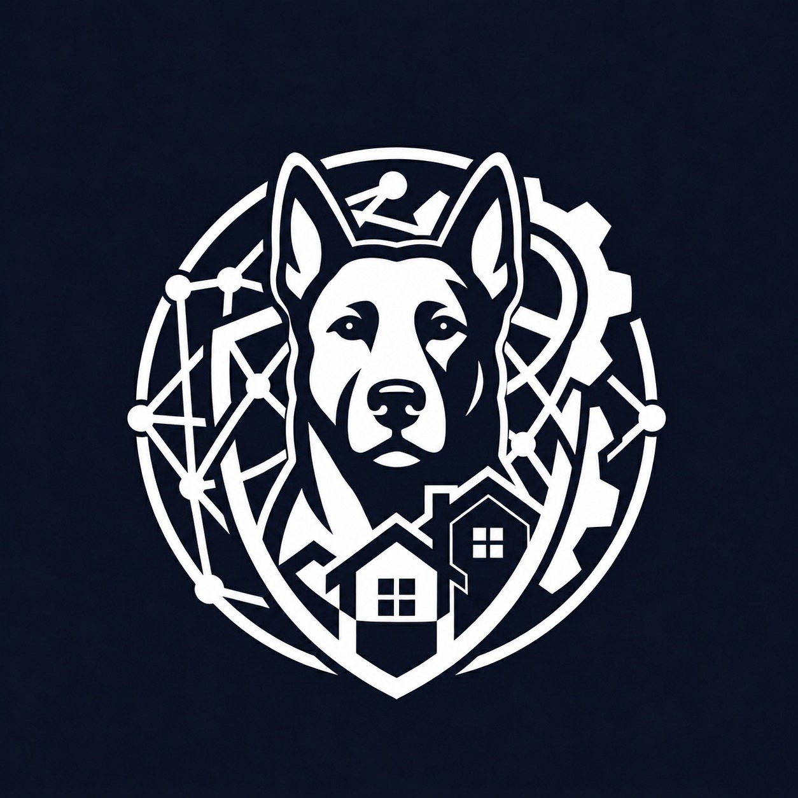

*Figure 1. Neighbourhood WatchDog identity mark.*

---

## 2. Who can do what

The options shown in the left navigation depend on the user’s role and whether the selected property belongs to a neighbourhood.

| User type | Typical actions |
|---|---|
| Resident | View authorised cameras, view alerts, acknowledge alerts, update personal contact details |
| Neighbourhood administrator | Manage neighbourhood join requests, set neighbourhood risk thresholds, configure authorised camera settings |
| System administrator | Access system audit information, in addition to permitted dashboard functions |

If a menu item is not visible, the current account may not have permission to use it. Do not share an account to work around permissions.

---

## 3. Before you begin

You need:

1. The approved WatchDog website address.
2. A working email address that can receive a confirmation code.
3. A property address to register.
4. If you are joining a neighbourhood, a valid join code from its administrator.
5. If you are adding a camera, the camera name, physical location, and connection information supplied by the deployment operator.
6. If you are pairing an Agent, access to the trusted computer on which the Agent will run.

For the demonstration pairing workflow, use native Windows Python 3.12. 

---

## 4. Create and confirm an account

### Create an account

1. Open the approved WatchDog website.
2. Select **Create account** or **Sign up**.
3. Enter your **First name**, **Last name**, **Address**, **Email**, **Password**, and **Confirm password**.
4. Make sure the passwords match. The password must contain at least eight characters; the service may also require numbers and special characters.
5. Select the submit button.
6. Watch for a confirmation message and check your email.

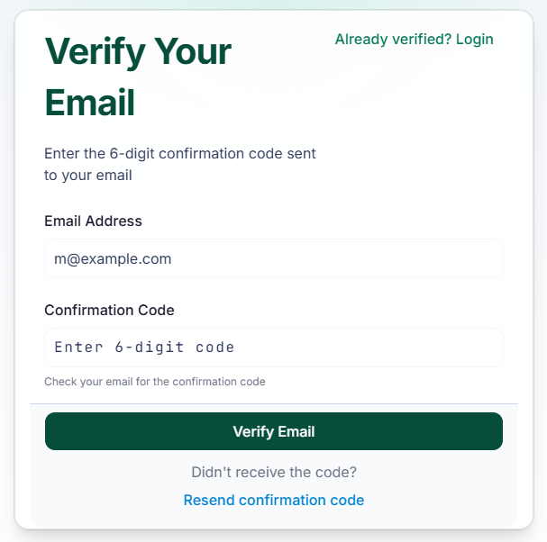

*Figure 2. Existing authentication.*

### Confirm the account

1. Open the confirmation-code screen, if it is not opened automatically.
2. Enter the code sent to your email address.
3. Submit the code.
4. Return to the login screen and sign in.

If the code expires or is incorrect, use the application’s resend or confirmation option if available. Do not repeatedly guess codes.

### Sign in

1. Enter your email address and password.
2. Select **Sign in** or **Login**.
3. If multi-factor authentication is requested, enter the code sent to the displayed destination.
4. After successful sign-in, WatchDog opens the dashboard. If you already have a property, it opens the camera page for the selected property.

If the account has not yet been confirmed, the login screen should direct you back to confirmation instead of repeatedly rejecting the password.

---

## 5. Create a property

A property is the place where one or more cameras are registered. A property is separate from a neighbourhood: creating one does not automatically create or join a neighbourhood.

1. Open the property selector or property-management option.
2. Select **Create property**.
3. Search for the address.
4. Select the correct address from the search results. Typing an address without selecting a result may not be accepted.
5. Select **Create property**.
6. Confirm that the new property appears in the property selector.

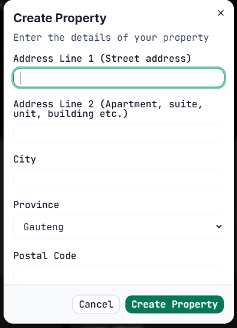
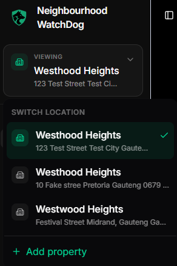

*Figure 3. Existing property and neighbourhood mockups. Replace with the live Create Property dialog in the final manual.*

### If the property is not shown

- Check that the address was selected from the address search results.
- Refresh the dashboard and reopen the property selector.
- If the problem continues, record the visible error message for the administrator. Do not include private account details in a public report.

---

## 6. Create or join a neighbourhood

Choose the option that matches your situation.

### Create a neighbourhood

Use this option when you are responsible for starting a new community group.

1. Select the property that should be associated with the neighbourhood.
2. Open **Create a neighbourhood**.
3. Enter a clear **Neighbourhood name**.
4. Enter the neighbourhood **Location**.
5. Select **Create neighbourhood**.
6. Store the generated join code securely and give it only to residents who should join.

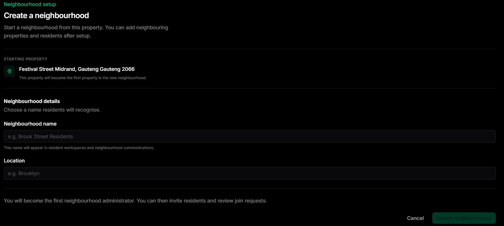

*Figure 4. The existing mockup shows the Create Neighbourhood form.*

### Join an existing neighbourhood

1. Select the property you want to associate with the neighbourhood.
2. Open **Join a neighbourhood**.
3. Enter the join code supplied by the neighbourhood administrator.
4. Submit the request.
5. Wait for the administrator to approve or deny the request.

Your request remains pending until the administrator resolves it. If the request is denied or the code is invalid, contact the administrator rather than creating multiple duplicate requests.

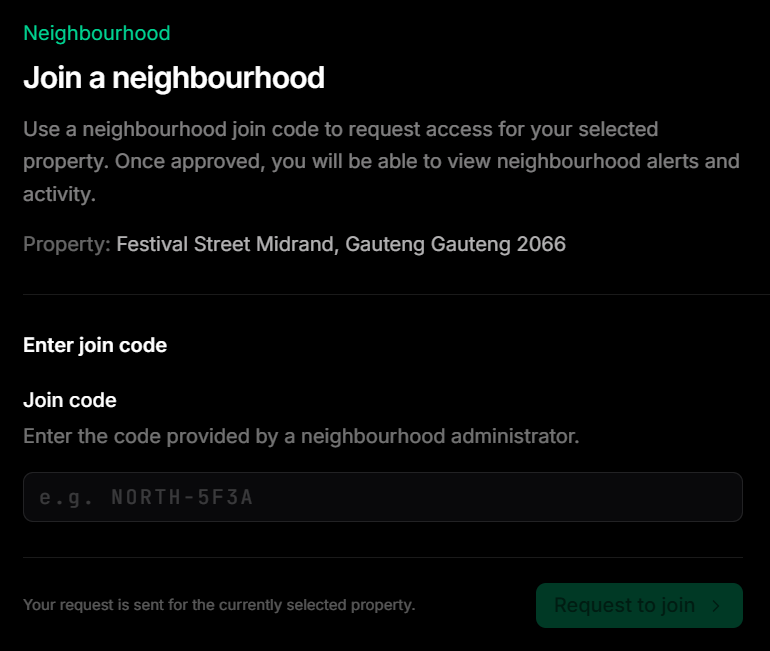
*Figure 5. The existing mockup shows the Join Neighbourhood form.*
---

## 7. Navigate the dashboard

The left sidebar is the main way to move through WatchDog. The active property and neighbourhood determine which options are shown.

### Main navigation options

- **My cameras:** View cameras registered for the selected property.
- **Connect agent:** Generate a one-time token for the local WatchDog Agent.
- **Live alerts:** View recent alerts for the selected neighbourhood.
- **Analytics:** View alert activity, risk-score history, and response metrics when data is available.
- **Join requests:** Administrator-only view for approving or denying membership requests.
- **Risk thresholds:** Administrator-only view for setting low and medium risk boundaries.
- **Settings:** Update profile and notification contact details.
- **Audit log:** System-administrator view of recorded system actions.

The property selector may display the address together with either **Standalone property** or the user’s neighbourhood role. Check this context before changing cameras or reviewing alerts.

> **Tip:** If the expected menu items are missing, first check that the correct property and neighbourhood are selected.

---

## 8. Add and manage cameras

### Add a camera

1. Open **My cameras**.
2. Select **Add camera**. If there are no cameras yet, select **Add your first camera**.
3. Enter a recognisable **Camera name**, such as `Front gate`.
4. Enter the physical **Camera location**, such as `Main entrance`.
5. Enter the camera’s **RTSP URL** supplied by the deployment operator.
6. Select **Acknowledge** to save the camera.

The current camera form requires a location and connection URL. Newly added cameras are registered as private by default in the current interface. Do not paste a real connection URL into this manual or into a screenshot.

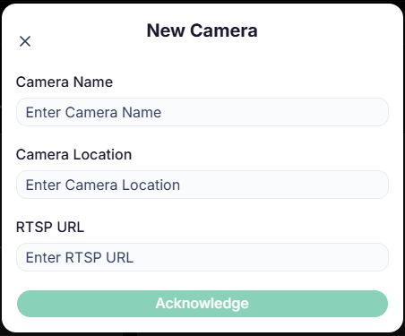
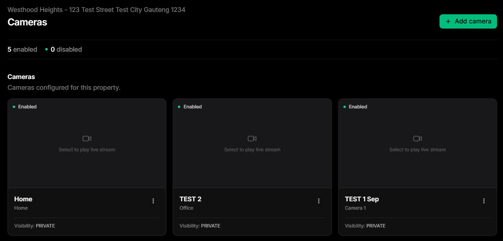

*Figure 6. Existing dashboard mockups illustrate the camera and alert areas.*

### Understand the camera list

The Cameras page shows:

- the selected property address;
- the number of enabled and disabled cameras;
- each camera’s name and location; and
- the camera visibility label.

A camera card can display these states:

| State | Meaning | What to do |
|---|---|---|
| **Live** | The camera stream is available | Select the camera to view it |
| **Connecting** | WatchDog is trying to start the stream | Wait briefly; if it persists, check the Agent and camera connection |
| **Unavailable** | The stream cannot currently be played | Check that the camera is enabled and publishing |
| **Disabled** | Monitoring is turned off for this camera | An authorised user must enable it before monitoring can resume |

### Edit or remove a camera

Use the camera’s action menu when available. Read the confirmation message carefully before removing a camera. Removing a camera can affect monitoring and future alerts for that camera.

---

## 9. Connect the WatchDog Agent

The Agent is the trusted local service that can reach the registered camera sources and send camera detections to WatchDog. This step is normally performed by a deployment or security operator.

### Generate a pairing token

1. Open **Connect agent** for the correct property.
2. Confirm that the displayed property address is correct.
3. Select **Generate pairing token**.
4. Select **Copy token**.
5. Enter the token in the Agent setup application on the trusted machine before it expires.
6. Confirm that the Agent reports a paired or connected state.
7. Return to WatchDog and enable the required camera.

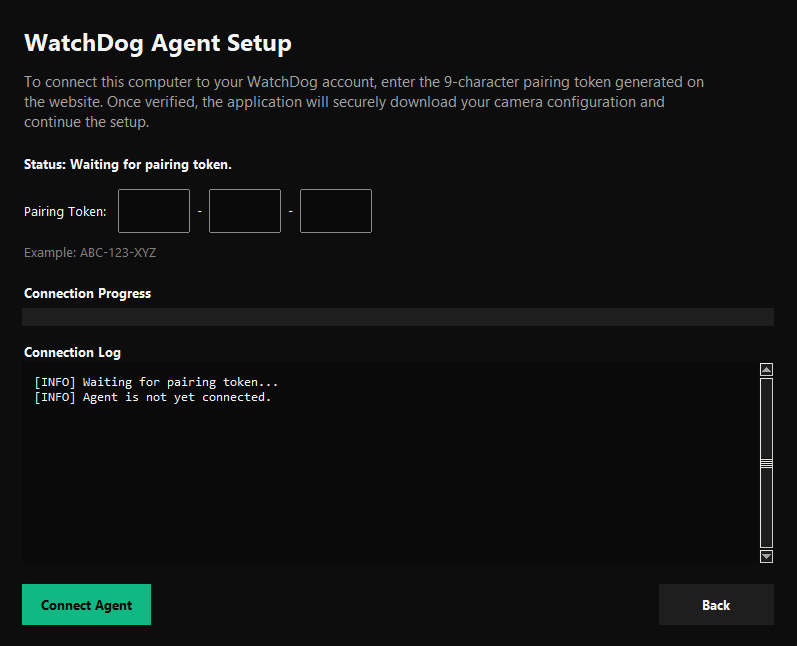

*Figure 7. Connect Agent page.*

A token is sensitive even if it is temporary. Treat it like a password: share it only with the person performing the pairing, then remove it from chat messages, notes, screenshots, and screen recordings.

### If pairing fails

- Confirm that the token belongs to the selected property.
- Generate a new token instead of reusing an expired one.
- Confirm that the Agent is running on the trusted machine.
- Confirm that the machine can reach the camera sources.
- Ask the deployment operator to check the Agent status and logs. Logs should not expose passwords or full credentialed camera URLs.

---

## 10. View a live camera

1. Open **My cameras**.
2. Select an enabled camera card.
3. Watch the status change from **Connecting** to **Live**.
4. Use the live view to inspect the selected camera.
5. Close the camera view when finished.

The browser requests a live stream after a user selects a camera. This avoids opening every camera stream automatically.

If the camera is unavailable, WatchDog should show an **Unavailable** state rather than a blank page. Check the camera status, the Agent connection, and the deployment’s camera publishing service before escalating.

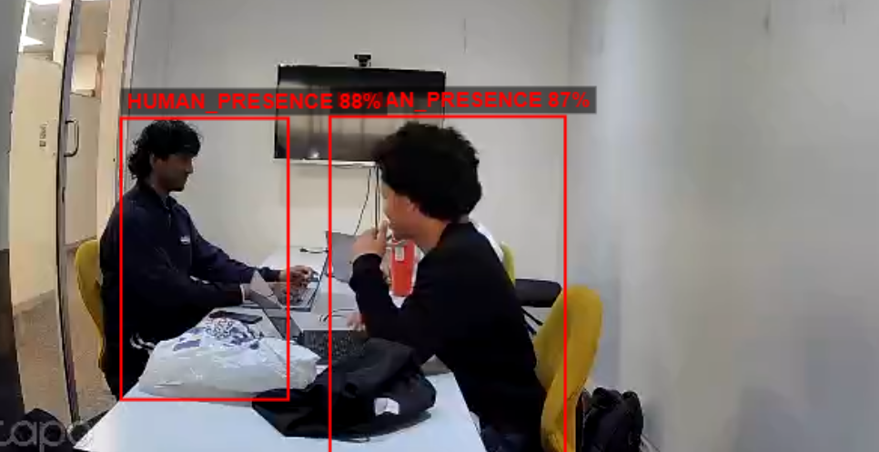

*Figure 8. Illustrative camera image.*
---

## 11. Configure detection settings

Detection settings are available only to authorised administrators.

### Set the confidence threshold

1. Open a camera’s live view.
2. Open **Camera Detection Settings**.
3. Find **Confidence threshold**.
4. Move the slider to the required percentage.
5. Release the slider to save the setting.

The helper text explains that detections below this confidence do not trigger alerts. A higher threshold can reduce false alerts but may also miss less-clear detections. Use the value agreed by the security team; do not change it casually during an incident.

### Add a detection zone

A detection zone limits monitoring to a selected part of the camera view.

1. Make sure the live view is open and showing the area you want to configure.
2. Select **Add zone**.
3. Select at least three points on the camera image to outline the area.
4. Click near the first circle to close the polygon, or select **Save zone**.
5. Confirm that the new zone appears under **Detection zones**.
6. Select **Refresh frame** if the background image is not current.
7. Select **Clear** to remove the points before saving, or **Cancel** to leave without creating a zone.

A camera with no configured zones treats all detections as eligible for alerting. Delete a zone only after confirming that it is no longer needed.

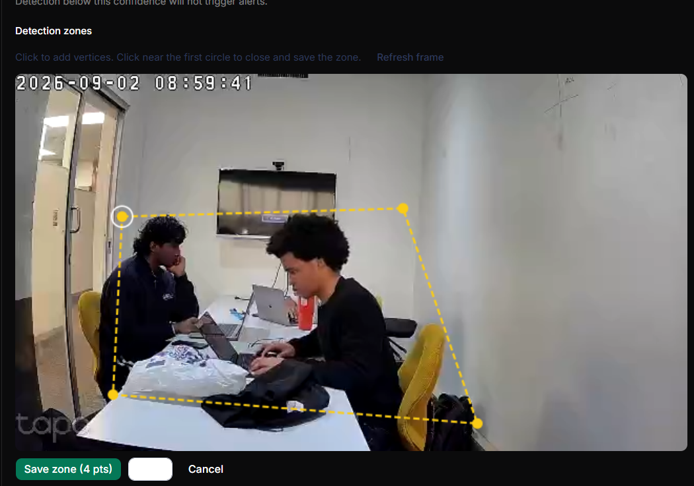

*Figure 9. Capture the Camera Detection Settings panel with the confidence slider and a visible polygon.*

---

## 12. Review and respond to alerts

Open **Live alerts** when you need to review current activity for the selected neighbourhood.

### Understand an alert card

An alert card can show:

- a severity label: **Critical**, **High**, **Medium**, or **Low**;
- a status label: **New**, **Acknowledged**, or **Resolved**;
- the detection type, such as **Person detected**, **Loitering detected**, **Perimeter scanning**, **Weapon detected**, or **Fall detected**;
- the camera identifier;
- the confidence percentage; and
- how long ago the alert was created.

The live indicator beside the Alerts heading shows whether real-time updates are connected. A disconnected indicator means the page may not receive new alerts until the connection is restored or the page is refreshed.

### Acknowledge an alert

Acknowledging means that a responsible person has seen the alert and is handling it.

1. Read the severity, detection type, camera, confidence, and time.
2. Select **Details** if you need the supporting image and full information.
3. Follow the applicable neighbourhood response procedure.
4. Select **Acknowledge** only when someone is actively handling the alert.
5. Confirm that the status changes from **New** to **Acknowledged**.

Acknowledgement does not mean that the event was harmless or that the incident is resolved.

### View full details

Select **Details** to open the detail panel. Depending on the alert, it may contain:

- a detection thumbnail;
- an H.264 MP4 clip for supported critical detections when footage is available;
- alert and camera identifiers;
- detection type;
- confidence score;
- detection time; and
- resolution information when present.

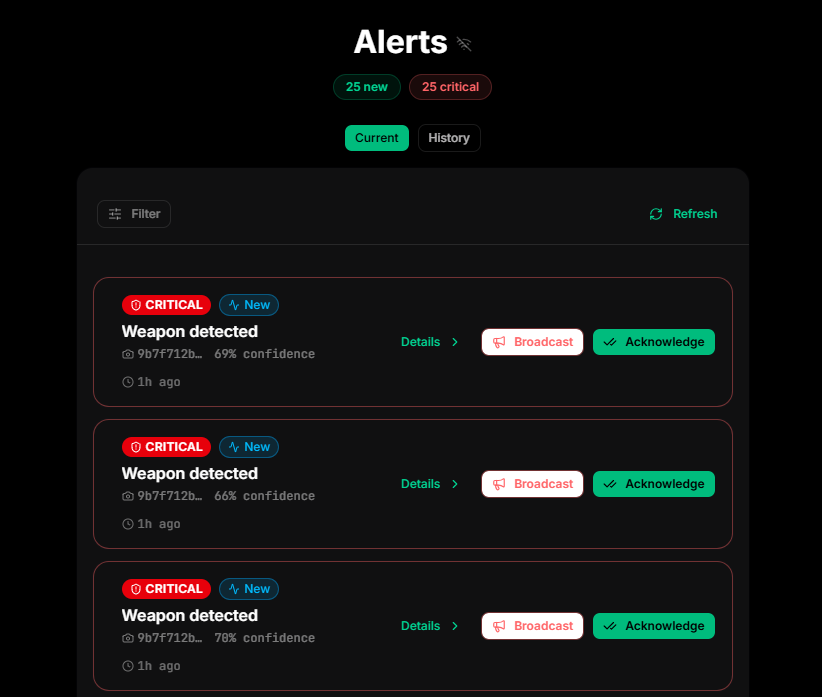

*Figure 10. Existing mockups show an Alerts list and an alert pop-up.*

### Broadcast an alert

The **Broadcast** action notifies the neighbourhood about an active alert. Use it only when the event is suitable for neighbourhood-wide communication and when the response procedure permits it.

1. Review the alert details first.
2. Confirm that it is still active and has not been resolved.
3. Select **Broadcast**.
4. Wait for the sending action to finish.
5. Continue following the response procedure.

Avoid broadcasting unverified or sensitive information. A broadcast is an external communication and should be treated as a deliberate safety action.

---

## 13. Use alert history and filters

The Alerts page provides two views:

- **Current:** Recent activity, covering the current monitoring window.
- **History:** Older alerts that can be reviewed using date filters.

1. Select **Current** or **History**.
2. Select **Filter**.
3. Choose one or more severity levels.
4. Optionally choose a status: **New**, **Acknowledged**, or **Resolved**.
5. In History, enter a start date and/or end date when needed.
6. Review the filtered list.
7. Refresh the page if the latest expected event is not visible.

If there are no matching records, WatchDog displays **No alerts**. This can mean that there are no events in the selected period or that the selected filters exclude them.

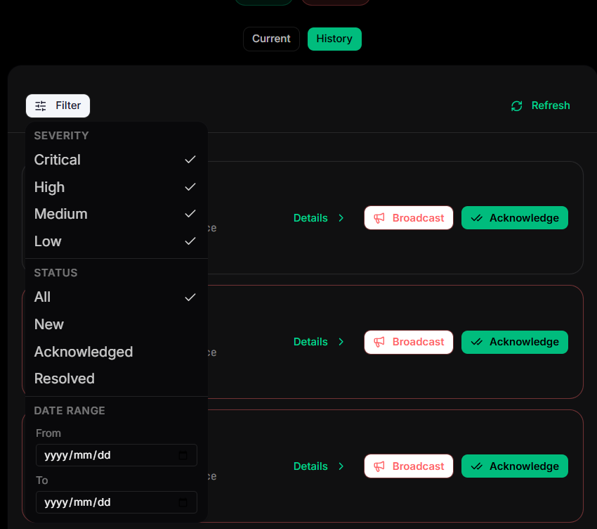

*Figure 11. Capture Current, History, and the Filter menu.*

---

## 14. Analytics

Select **Analytics** to review neighbourhood-level information when the account has access and data has been calculated.

The page can include:

- risk-score history;
- alert-frequency information; and
- alert-response metrics.

Use **Refresh** to request the latest information. If the system has not calculated any risk history yet, the page may display **No calculated risk-score history is available yet**. This is an empty state, not necessarily an application failure.

Analytics should be interpreted as decision support. Confirm important incidents against the alert details and the live camera view where available.

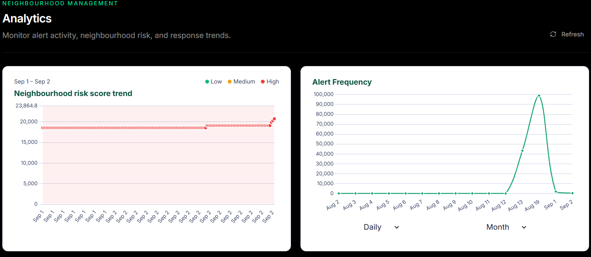

*Figure 12. The Analytics page.*

---

## 15. Neighbourhood administration

### Review join requests

Administrators can open **Join requests** to see residents requesting access to the neighbourhood.

1. Open **Join requests**.
2. Review the resident request and the current status.
3. Use the status filter to view **Pending**, **Approved**, **Denied**, or **All** requests.
4. Approve or deny the request according to the neighbourhood’s membership policy.
5. Confirm that the request status updates.
6. Use the page’s refresh option if another administrator has changed a request.

The page also displays the neighbourhood join code to authorised administrators. Keep the code private and regenerate it if it has been shared too widely.

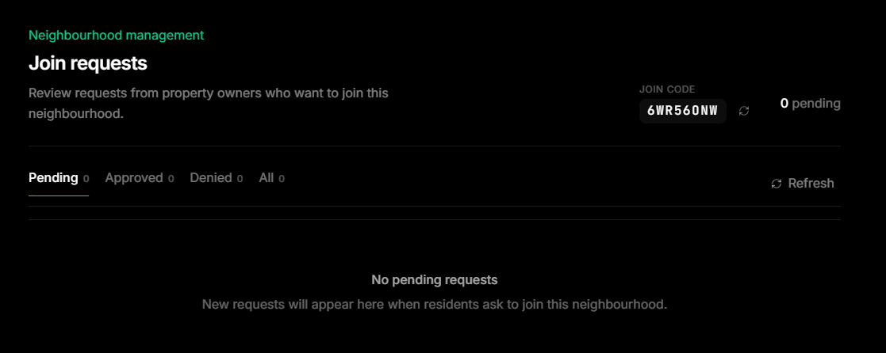

*Figure 13. Pending filter and request actions.*

### Set risk thresholds

Administrators can open **Risk thresholds** to set boundaries for neighbourhood risk classifications.

1. Open **Risk thresholds**.
2. Review the current **Low risk max** and **Medium risk max** values.
3. Enter the new values when authorised to change them.
4. Keep the values between 0 and 100.
5. Ensure that **Medium risk max** is greater than **Low risk max**.
6. Select **Save thresholds**.
7. Confirm the success message and the updated timestamp.

These thresholds apply to the cameras and residents in the selected neighbourhood. Record policy-approved changes outside the system according to the project’s governance process.

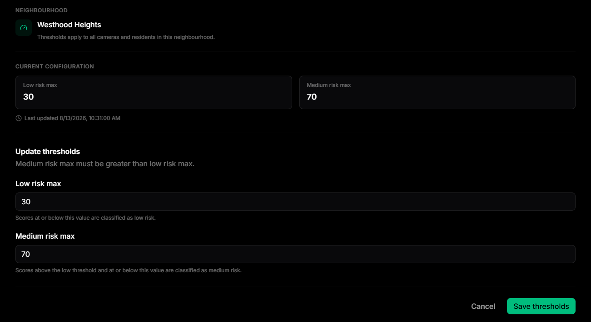

*Figure 14. Capture the current configuration and update form.*

---

## 16. Account settings and notifications

1. Open **Settings**.
2. Under **Profile**, update your first and last name if needed.
3. Under **Notifications**, review the account email and enter a phone number for WhatsApp alerts when enabled by the deployment.
4. The account email is managed by authentication and is read-only on this page.
5. Under **Account**, review the displayed system role.
6. Select **Save changes**.
7. Confirm the **Settings updated** message.

A phone number must be valid before it can be saved. Use the international format recommended by the deployment, for example `+27 ...`, and do not place a real number in the manual screenshots.

The availability of WhatsApp and email notifications depends on the deployment configuration. If notifications are not enabled, continue using the dashboard’s alert feed and follow the local response process.

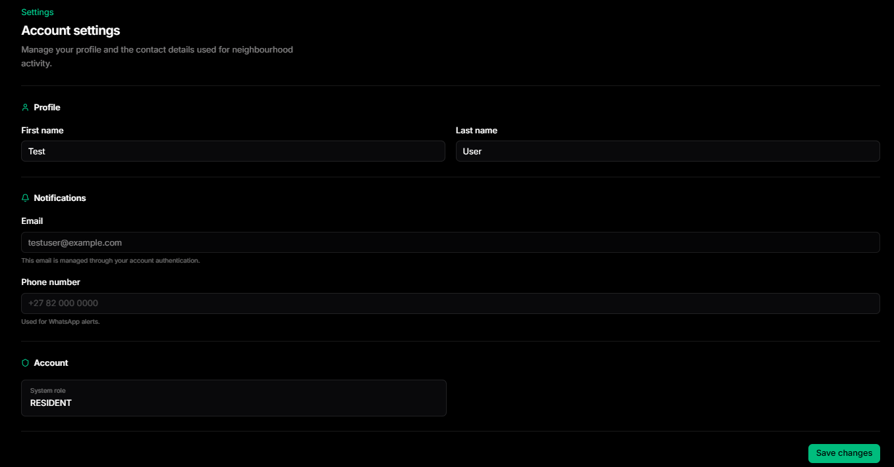

*Figure 15. Capture the Settings page.*

---

## 17. Troubleshooting

| Problem | Likely cause | First action |
|---|---|---|
| Cannot sign in | Incorrect credentials or unconfirmed account | Confirm the email first; then retry once and use password recovery if available |
| No property appears | Property was not created or the wrong context is selected | Refresh and check the property selector |
| Camera shows Disabled | Monitoring was turned off | Ask an authorised user to enable it |
| Camera stays Connecting | Agent, publisher, or network is not ready | Wait briefly, then check Agent and camera status |
| Camera shows Unavailable | Camera is not actively publishing | Confirm the camera is enabled and the Agent can reach it |
| No alerts appear | No qualifying event, an active filter, or disconnected live updates | Clear filters, check Current/History, and refresh |
| Alert details have no thumbnail | Supporting image is unavailable | Use the alert metadata and follow the response procedure |
| Clip is not available | Footage upload is still pending or unavailable | Do not repeatedly submit; report the alert ID through the approved support channel |
| Cannot join neighbourhood | Invalid code or pending request | Request a fresh code or wait for administrator review |
| Cannot save thresholds | Values are invalid or incorrectly ordered | Use values from 0–100 and make medium greater than low |
| Notifications do not arrive | Notification delivery is not enabled or contact details are incomplete | Check Settings and contact the deployment administrator |

When reporting a problem, include the screen name, the visible error message, approximate time, and a redacted screenshot. Never include passwords, pairing tokens, API keys, or credentialed camera URLs.

---

## 18. Safety, privacy, and responsible use

- Treat alerts as indicators that require human review, not automatic proof of wrongdoing.
- Follow the neighbourhood’s emergency and escalation procedures.
- Do not use broadcast messaging to spread unverified accusations or personal information.
- Share camera access only with authorised users.
- Keep join codes, pairing tokens, camera connection details, and passwords private.
- Redact personal details and system identifiers from screenshots used in reports or demonstrations.
- Do not leave live camera views open where unauthorised people can see them.
- Use the minimum access required for each role.
- Report false positives and missed detections to the administrator so thresholds and zones can be reviewed.

---